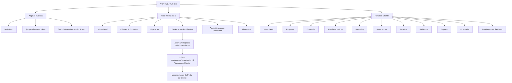
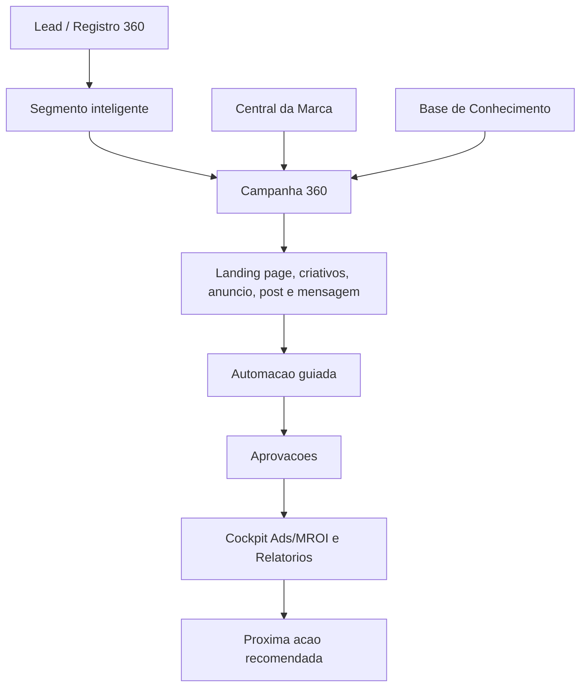
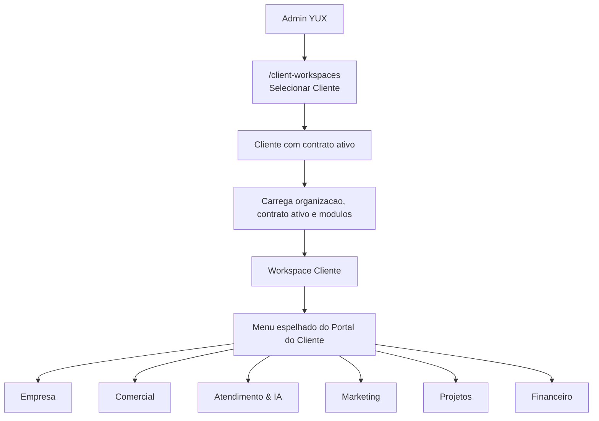

# Mapa de paginas e funcionalidades - Portal YUX

Atualizado em 2026-06-08.

Este documento descreve a arquitetura atual de navegacao do frontend, com base
nas rotas de `frontend/src/App.tsx`, nas regras de navegacao de
`frontend/src/lib/platform/navigation.ts` e nas paginas em `frontend/src/pages`.

A reorganizacao atual separa claramente:

- area interna da YUX;
- operacao assistida dos clientes por admins;
- portal real do cliente;
- paginas publicas.

A camada Growth Workspace conecta essas areas em jornadas comerciais:

- Registro 360 para acompanhar cada lead/contato com acoes, abas,
  associacoes, timeline e inteligencia;
- Campanha 360 para planejar campanhas por objetivo com checklist de ativos;
- onboarding por modelo setorial;
- Central da Marca e Base de Conhecimento como fontes compartilhadas;
- biblioteca de templates, segmentos inteligentes e automacoes guiadas;
- cockpit executivo Ads/MROI e presets de relatorios.

Status atual: as fases 1 a 7 do Growth Workspace estao implementadas e
validadas localmente em `http://127.0.0.1:3000`. A validacao cobriu admin,
workspace assistido e portal do cliente demo.

## 1. Mapa macro

### Strategy Engine

Rota interna: `/admin/strategy-engine`.

Funcionalidades:

- inspecao de perfis estrategicos, skills, cards conceituais e bindings;
- logs de retrieval por perfil e etapa comercial;
- leitura de recomendacoes, handoffs, playbooks de objecao e snapshots de Metrics & Cash;
- governanca interna para Marketing Studio, CRM Controller, SDR/Closer/Suporte/Retencao e Revenue Recovery.

Essa rota e interna da YUX. O portal do cliente recebe apenas recomendacoes aprovadas e contexto `client_safe` quando uma superficie futura expuser esses dados.

### Growth Workspace - fluxo comercial conectado

### Growth Workspace - blocos implantados

| Bloco | Onde aparece | Funcao principal |
| --- | --- | --- |
| Registro 360 | `/leads`, `/portal/comercial/leads`, `/client-workspaces/:organizationId/comercial/leads` | Unificar identidade, acoes rapidas, abas, associacoes, atividades, conversas, propostas e inteligencia do lead/contato. |
| Segmentos inteligentes | `/leads` | Criar publicos a partir de origem, etapa, status, responsavel, atividade, campanha, score e proposta. |
| Campanha 360 | `/campaigns`, `/portal/marketing/campanhas`, `/client-workspaces/:organizationId/marketing/campanhas` | Planejar campanha por objetivo e checklist de segmentacao, landing page, formulario, criativos, anuncio, post, mensagem, automacao, aprovacao e relatorio. |
| Central da Marca | `/portal/empresa/marca`, `/client-workspaces/:organizationId/empresa/marca` | Concentrar tom, persona, ativos, guardrails, produtos, promessas, restricoes e prontidao da marca. |
| Base de Conhecimento | `/portal/empresa/conhecimento`, `/client-workspaces/:organizationId/empresa/conhecimento` | Alimentar Agente IA, Marketing Studio, campanhas, landing pages, FAQ, respostas sugeridas e suporte. |
| Modelos Setoriais | `/blueprints`, `/contracts`, `/client-conversions` | Configurar setores, aplicar blueprint em contratos e gerar onboarding/checklists. |
| Automacoes guiadas | `/automations`, `/portal/automacoes/*` | Partir de objetivos de negocio antes do builder tecnico. |
| Cockpit Ads/MROI | `/campaigns`, `/reports`, `/portal/relatorios`, `/portal/marketing/campanhas` | Mostrar investimento, cliques, leads, CPL, clientes, receita, MROI, sync status e recomendacoes. |
| Presets e resumo de IA | `/reports`, `/portal/relatorios` | Padronizar leituras executivas e destacar oportunidade, mudanca no periodo, lacunas e ressalvas de atribuicao. |

## 2. Fluxo de operacao de cliente por admin

O admin nao entra direto em CRM, Conversas ou Marketing Studio de um cliente
sem contexto. O fluxo correto e selecionar primeiro o cliente.

Regras importantes:

- `/client-workspaces` mostra a lista de clientes operaveis.
- `/client-workspaces/:organizationId` abre a visao geral daquele cliente.
- As subrotas do workspace usam o mesmo desenho do portal, por exemplo
  `/client-workspaces/:organizationId/marketing/studio`.
- As paginas reaproveitadas do portal convertem links internos para o prefixo
  do workspace, evitando voltar para `/portal`.
- Se a YUX quiser operar sua propria divulgacao como cliente, o caminho
  recomendado e criar uma organizacao cliente "YUX" e opera-la por
  Workspaces dos Clientes. A operacao comercial, marketing e atendimento da
  propria YUX deve acontecer em um cliente/organizacao "YUX", acessado como
  "Crescimento YUX".

## 3. Area interna YUX

### Visao Geral

Rota principal:

- `/dashboard`

Funcionalidades:

- visualizar resumo interno;
- acompanhar atividades recentes e pendencias;
- acessar rapidamente clientes, contratos, operacao, comercial, suporte e
  financeiro;
- servir como entrada para usuarios internos.

### Clientes & Contratos

Rotas principais:

- `/clients`;
- `/client-conversions`;
- `/contracts`;
- `/packages`;
- `/modules`;
- `/admin/limits`.

Funcionalidades:

- listar, buscar, filtrar, criar, editar, importar e exportar clientes;
- converter leads fechados do workspace YUX em cliente, organizacao, contrato e
  historico administrativo;
- gerenciar contratos ativos, pausados ou encerrados;
- vincular pacotes comerciais aos contratos;
- aplicar modelos setoriais aos contratos;
- controlar modulos contratados;
- revisar limites, creditos e regras por cliente;
- acessar detalhes de cliente, contratos, projetos e dados operacionais;
- definir o que aparece no portal conforme contrato e permissoes.

### Operacao

Rotas principais:

- `/projects`;
- `/support`.

Funcionalidades:

- gerenciar projetos, fases, tarefas e entregaveis;
- acompanhar aprovacoes e timeline;
- registrar suporte interno e suporte visivel ao cliente;
- controlar prioridade, status, SLA e historico de atendimento;
- separar execucao de servicos da administracao da plataforma.

### Workspaces dos Clientes

Rotas principais:

- `/client-workspaces`;
- `/client-workspaces/:organizationId`;
- `/client-workspaces/:organizationId/empresa/perfil`;
- `/client-workspaces/:organizationId/comercial/leads`;
- `/client-workspaces/:organizationId/atendimento/conversas`;
- `/client-workspaces/:organizationId/marketing/studio`;
- demais subrotas equivalentes ao portal.

Funcionalidades:

- selecionar primeiro qual cliente sera operado;
- listar clientes com contrato ativo;
- mostrar clientes sem contrato ativo como nao liberados;
- carregar contexto do cliente selecionado;
- operar como cliente com banner "Operando como cliente";
- trocar cliente sem misturar contextos;
- abrir o mesmo menu do Portal do Cliente;
- operar CRM, Conversas, Agente IA, Canais, Marketing, Projetos, Relatorios,
  Suporte e Financeiro com as permissoes e modulos daquele cliente.
- acessar "Crescimento YUX" como atalho para operar a propria YUX usando a
  mesma experiencia do cliente.

### Conversoes de Leads

Rota principal:

- `/client-conversions`

Funcionalidades:

- selecionar o workspace de origem, preferencialmente o cliente/organizacao YUX;
- carregar leads do CRM desse workspace;
- escolher o lead fechado;
- preencher dados do cliente administrativo;
- selecionar pacote vendido;
- selecionar modelo setorial opcional;
- criar cliente em Clientes & Contratos;
- criar organizacao de portal para o cliente;
- criar contrato ativo;
- habilitar modulos do pacote ou aplicar blueprint escolhido;
- marcar o lead como ganho/convertido;
- preservar origem comercial, fonte, workspace e atribuicao nas notas.

### Administracao da Plataforma

Rotas principais:

- `/admin`;
- `/blueprints`;
- `/admin/modules-governance`;
- `/admin/integrations`;
- `/admin/ai`;
- `/admin/channels`;
- `/admin/email`;
- `/admin/health`;
- `/crm-governance`.

Funcionalidades:

- administrar a plataforma YUX;
- gerenciar Modelos Setoriais e catalogo de modulos;
- configurar integracoes globais;
- acompanhar IA, modelos, custos e politicas;
- gerenciar canais e e-mail;
- ver saude da plataforma;
- acompanhar logs, auditoria e clientes impactados;
- governar CRM por contrato;
- manter configuracoes que o cliente nunca deve acessar diretamente.

### Modelos Setoriais

Rota principal:

- `/blueprints`

Funcionalidades:

- listar blueprints/modelos por setor;
- visualizar modulos recomendados;
- visualizar funil padrao e etapas;
- visualizar campos, templates de mensagem, automacoes e presets de relatorio;
- aplicar modelo a um contrato existente;
- registrar execucoes de aplicacao;
- separar "pacote vendido" de "configuracao setorial aplicada".

Locais de aplicacao:

- em `/blueprints`, escolhendo um contrato;
- em `/contracts`, no painel lateral do contrato selecionado;
- em `/client-conversions`, durante a conversao de um lead fechado em cliente.

### Financeiro interno

Rota principal:

- `/finance`

Funcionalidades:

- ver faturas emitidas, recebidas, abertas, vencidas e proximas;
- criar faturas;
- adicionar itens de cobranca;
- marcar fatura como paga;
- cancelar fatura;
- acompanhar receita e cobrancas.

## 4. Portal do Cliente e Workspace Cliente

As rotas do Portal do Cliente usam o prefixo `/portal`. As mesmas paginas sao
reaproveitadas pelo admin dentro de `/client-workspaces/:organizationId`.

| Area | Portal do Cliente | Workspace Cliente |
| --- | --- | --- |
| Visao Geral | `/portal` | `/client-workspaces/:organizationId` |
| Empresa | `/portal/empresa/*` | `/client-workspaces/:organizationId/empresa/*` |
| Comercial | `/portal/comercial/*` | `/client-workspaces/:organizationId/comercial/*` |
| Atendimento & IA | `/portal/atendimento/*` | `/client-workspaces/:organizationId/atendimento/*` |
| Marketing | `/portal/marketing/*` | `/client-workspaces/:organizationId/marketing/*` |
| Automacoes | `/portal/automacoes/*` | `/client-workspaces/:organizationId/automacoes/*` |
| Projetos | `/portal/projetos/*` | `/client-workspaces/:organizationId/projetos/*` |
| Relatorios | `/portal/relatorios` | `/client-workspaces/:organizationId/relatorios` |
| Suporte | `/portal/suporte` | `/client-workspaces/:organizationId/suporte` |
| Financeiro | `/portal/financeiro` | `/client-workspaces/:organizationId/financeiro` |
| Conta | `/portal/configuracoes/conta` | `/client-workspaces/:organizationId/configuracoes/conta` |

### Visao Geral

Rota:

- `/portal`

Funcionalidades:

- exibir contrato ativo;
- mostrar pacote, status, data de inicio e quantidade de areas ativas;
- mostrar atalho fixo de Pendencias de Aprovacao;
- listar proximas acoes do cliente;
- consolidar aprovacoes de projetos, revisoes de marketing, criativos,
  follow-ups atrasados, faturas e projetos em revisao;
- listar cards resumidos dos modulos contratados;
- bloquear a experiencia quando nao houver contrato ativo.

### Empresa

#### Perfil da Empresa

Rota:

- `/portal/empresa/perfil`

Funcionalidades:

- centralizar dados institucionais e comerciais;
- mostrar contexto carregado do contrato/organizacao;
- apresentar informacoes operacionais da empresa;
- servir de base para atendimento, marketing, campanhas e relatorios;
- acessar atalhos relacionados a marca, conhecimento e integracoes.

#### Usuarios e Equipe

Rota:

- `/portal/empresa/usuarios`

Funcionalidades:

- organizar usuarios, papeis e acesso por modulo;
- orientar perfis como administrador da empresa, gestor comercial, atendente,
  marketing, financeiro e visualizador;
- delimitar acesso a chat, financeiro, campanhas e demais areas;
- preparar gestao de convites, remocao e desativacao;
- separar permissoes pessoais de dados da empresa.

#### Base de Conhecimento

Rota:

- `/portal/empresa/conhecimento`

Funcionalidades:

- listar documentos e conhecimentos recentes;
- cadastrar e revisar conhecimento da empresa;
- organizar conteudo por categorias;
- marcar conteudo como publico ou interno;
- alimentar Agente IA, Marketing Studio, respostas sugeridas, campanhas,
  landing pages, FAQ e suporte;
- evidenciar lacunas e fontes que precisam de revisao.

#### Marca e Tom de Voz

Rota:

- `/portal/empresa/marca`

Funcionalidades:

- definir tom da marca e nivel de formalidade;
- controlar uso de emojis, palavras proibidas e temas proibidos;
- registrar personas e exemplos de comunicacao;
- definir promessas permitidas e restricoes legais;
- expor guardrails para conteudo, campanhas e atendimento.

#### Integracoes da Empresa

Rota:

- `/portal/empresa/integracoes`

Funcionalidades:

- acompanhar conexoes do cliente;
- mostrar canais, publicacao, midia, calendario, planilhas e webhooks;
- ver status de conexao, ultima sincronizacao e necessidade de reautenticacao;
- acessar atalhos para canais, campanhas e Marketing Studio.

### Comercial

#### Leads

Rota:

- `/portal/comercial/leads`

Funcionalidades:

- acessar CRM do cliente;
- ver pipelines, listas, kanban, tarefas e origens;
- filtrar e acompanhar leads por etapa, origem, temperatura e responsavel;
- abrir detalhes de lead;
- abrir Registro 360 com identidade, acoes rapidas, abas, timeline,
  associacoes, propostas/receita e inteligencia;
- criar segmentos inteligentes por origem, etapa, status, responsavel, ultima
  atividade, campanha, score e status de proposta;
- usar segmento para criar tarefa, iniciar automacao, criar campanha ou
  exportar;
- acompanhar historico, tarefas, automacoes, propostas e insights comerciais;
- manter escopo filtrado pelo contrato e pela organizacao do cliente.

#### Empresas / Contas

Rota:

- `/portal/comercial/contas`

Funcionalidades:

- agrupar leads por empresa;
- visualizar contatos vinculados;
- acompanhar potencial, oportunidades e historico;
- apoiar operacao B2B;
- navegar para funis, tarefas e leads relacionados.

#### Funis

Rota:

- `/portal/comercial/funis`

Funcionalidades:

- visualizar pipelines ativos;
- ver etapas configuradas;
- analisar valor aberto, conversao e gargalos;
- identificar oportunidades paradas;
- acessar leads do funil.

#### Tarefas e Follow-ups

Rota:

- `/portal/comercial/tarefas`

Funcionalidades:

- listar tarefas comerciais;
- destacar tarefas atrasadas;
- agrupar por lead, empresa, responsavel e prazo;
- concluir, reagendar ou acompanhar proximas acoes;
- alimentar a area de proximas acoes da visao geral.

### Atendimento & IA

#### Conversas

Rota:

- `/portal/atendimento/conversas`

Funcionalidades:

- abrir inbox de conversas do cliente;
- filtrar por canal, status, fila, atendente e handoff;
- ver mensagens e contexto;
- enviar resposta humana quando permitido;
- aprovar sugestoes de IA;
- resolver, reabrir ou transferir conversa;
- vincular conversa ao contexto comercial.

#### Agente IA

Rota:

- `/portal/atendimento/agente-ia`

Funcionalidades:

- acompanhar prontidao do agente;
- ver objetivos, regras, handoff e fontes usadas;
- acessar base de conhecimento;
- visualizar execucoes recentes;
- acompanhar perguntas sem resposta e necessidade de treinamento.

#### Canais

Rota:

- `/portal/atendimento/canais`

Funcionalidades:

- ver canais conectados;
- acompanhar WhatsApp, Instagram, Facebook Messenger e webchat quando
  disponiveis;
- ver status operacional, ultima sincronizacao e necessidade de reautenticacao;
- diferenciar conexoes ativas de canais ainda nao conectados.

#### Filas e Handoff

Rota:

- `/portal/atendimento/filas-handoff`

Funcionalidades:

- descrever equipes e filas de atendimento;
- organizar regras de transferencia;
- considerar horario comercial, prioridade e SLA;
- direcionar o cliente para Conversas e Agente IA.

### Marketing

#### Landing Pages

Rota:

- `/portal/marketing/landing-pages`

Funcionalidades:

- listar landing pages;
- ver status, thumbnail, versoes e formularios;
- abrir preview;
- acompanhar visitas, leads, conversao e aprovacoes;
- solicitar ajustes e acompanhar publicacao.

#### Campanhas

Rota:

- `/portal/marketing/campanhas`

Funcionalidades:

- listar campanhas Meta, Google ou manuais;
- criar Campanha 360 a partir de objetivo;
- acompanhar checklist de campanha: segmento, landing page, formulario,
  criativos, anuncio, post, follow-up, automacao, aprovacao e relatorio;
- acessar biblioteca de templates filtrada por objetivo e etapa da campanha;
- ver status, orcamento, gasto, leads, CPL e MROI;
- ver cockpit executivo Ads/MROI com investimento, cliques, leads, CPL,
  clientes, MROI, modelo de atribuicao, saude de sincronizacao e recomendacao;
- acompanhar criativos e aprovacoes;
- ver alertas, recomendacoes e sincronizacao de metricas;
- sinalizar provider desconectado ou com reautenticacao pendente.

#### Marketing Studio

Rota:

- `/portal/marketing/studio`

Funcionalidades:

- acompanhar conteudo, ideias, calendario, aprovacoes e creditos;
- ver agentes, workflows e execucoes;
- aprovar, pedir ajustes ou acompanhar revisoes;
- consultar base de conhecimento, produtos, marca e documentos;
- acompanhar publicacao WordPress, canais nativos, criativos e rascunhos de
  campanha quando configurados.

#### Conteudo Organico

Rota:

- `/portal/marketing/conteudo`

Funcionalidades:

- listar posts, artigos, roteiros, newsletters e ideias;
- acompanhar status, canal, aprovacao, publicacao e performance;
- abrir Marketing Studio como superficie principal de producao.

#### Calendario Editorial

Rota:

- `/portal/marketing/calendario`

Funcionalidades:

- visualizar calendario semanal/mensal;
- acompanhar posts agendados, campanhas, conteudos aprovados e pendencias;
- filtrar por canal e status;
- abrir Marketing Studio para edicao detalhada.

#### Criativos e Assets

Rota:

- `/portal/marketing/criativos`

Funcionalidades:

- listar imagens, videos, copies e variacoes de anuncios;
- acompanhar pecas aprovadas e sugestoes de campanha;
- ver comentarios e aprovacoes;
- navegar para campanhas e Marketing Studio.

### Automacoes

Rotas:

- `/portal/automacoes/fluxos`;
- `/portal/automacoes/templates`;
- `/portal/automacoes/execucoes`;
- `/portal/automacoes/logs`.

Funcionalidades:

- apresentar modulo protegido no portal;
- mostrar capacidades contratadas sem expor configuracoes sensiveis;
- separar Fluxos, Templates, Execucoes e Logs;
- iniciar automacoes por objetivo de negocio antes do builder tecnico;
- objetivos disponiveis: responder lead novo, follow-up de proposta, reativar
  cliente, confirmar agendamento, lembrar atendimento, criar tarefa para
  vendedor, avisar campanha com CPL alto e pedir aprovacao de criativo;
- usar templates por setor, modulo, objetivo, canal e visibilidade;
- preparar acesso futuro para pausa, duplicacao, historico, erros e consumo de
  creditos.

### Projetos

#### Projetos

Rota:

- `/portal/projetos/projetos`

Funcionalidades:

- listar projetos do cliente;
- acompanhar progresso, fases, responsaveis e prazos;
- ver entregaveis e timeline;
- aprovar ou solicitar ajustes quando houver decisao pendente.

#### Aprovacoes

Rota:

- `/portal/projetos/aprovacoes`

Funcionalidades:

- centralizar aprovacoes de landing pages, campanhas, criativos, propostas,
  documentos e entregaveis;
- listar fila consolidada;
- aprovar, pedir alteracao ou acompanhar itens pendentes;
- servir como destino do atalho fixo da visao geral.

#### Documentos

Rota:

- `/portal/projetos/documentos`

Funcionalidades:

- centralizar contratos, propostas, relatorios, arquivos de campanha, manuais e
  documentos da empresa;
- listar propostas, contratos e documentos financeiros;
- respeitar permissoes e visibilidade do cliente.

### Relatorios

Rota:

- `/portal/relatorios`

Funcionalidades:

- ver indicadores consolidados permitidos ao cliente;
- analisar funil, campanhas, landing pages, propostas, conversas e atividades;
- acessar presets: performance de campanhas, ROI por origem de lead,
  conversao de landing pages, follow-up WhatsApp, impacto das automacoes,
  onboarding por setor e prontidao de marca/conhecimento;
- acompanhar cockpit executivo Ads/MROI com gasto, impressoes, cliques, leads,
  CPL, oportunidades, propostas, clientes, receita, MROI e sync status;
- ver resumo de IA com melhor oportunidade, mudanca no periodo, lacunas de
  dados e ressalva quando atribuicao estiver ausente;
- acompanhar ROI/MROI sem expor custos ou dados internos indevidos;
- exportar ou consultar relatorios quando o modulo estiver ativo.

### Suporte

Rota:

- `/portal/suporte`

Funcionalidades:

- abrir chamados;
- acompanhar chamados existentes;
- ver status, prioridade e SLA;
- enviar mensagens;
- acompanhar historico e resolucao.

### Financeiro

Rota:

- `/portal/financeiro`

Funcionalidades:

- ver faturas;
- acompanhar status de pagamento;
- consultar valores, vencimentos e itens;
- ver aberto, pago, vencido e proximo vencimento;
- manter area financeira separada das configuracoes da empresa.

### Configuracoes da Conta

Rota:

- `/portal/configuracoes/conta`

Funcionalidades:

- concentrar preferencias pessoais do usuario;
- tratar notificacoes, seguranca, idioma, sessoes e dados do usuario;
- evitar duplicacao com a area Empresa;
- manter dados da empresa, usuarios, integracoes e base de conhecimento dentro
  de Empresa.

## 5. Rotas antigas e redirecionamentos

As rotas antigas continuam existindo como compatibilidade, mas redirecionam para
a nova arquitetura:

| Rota antiga | Nova rota |
| --- | --- |
| `/portal/projects` | `/portal/projetos/projetos` |
| `/portal/proposals` | `/portal/projetos/aprovacoes` |
| `/portal/crm` | `/portal/comercial/leads` |
| `/portal/crm/settings` | `/portal/empresa/usuarios` |
| `/portal/omnichannel` | `/portal/atendimento/conversas` |
| `/portal/omnichannel/channels` | `/portal/atendimento/canais` |
| `/portal/whatsapp-ai` | `/portal/atendimento/conversas` |
| `/portal/landing-pages` | `/portal/marketing/landing-pages` |
| `/portal/marketing-studio` | `/portal/marketing/studio` |
| `/portal/campaigns` | `/portal/marketing/campanhas` |
| `/portal/reports` | `/portal/relatorios` |
| `/portal/support` | `/portal/suporte` |
| `/portal/finance` | `/portal/financeiro` |
| `/whatsapp-ai` | `/omnichannel` |

## 6. Observacoes de produto

- O portal agora e organizado por trabalho real do cliente, nao por modulo
  tecnico.
- "Omnichannel" virou "Atendimento & IA" no portal.
- "CRM" aparece para o cliente como "Comercial".
- "Knowledge Source" aparece como "Base de Conhecimento".
- "Marketing Studio" foi quebrado em area de Marketing com paginas especificas
  de Landing Pages, Campanhas, Conteudo, Calendario e Criativos.
- "Configuracoes da Conta" e pessoal; dados da empresa ficam em Empresa.
- "Workspaces dos Clientes" e uma operacao assistida da YUX, nao uma area de
  administracao global.
- Administracao da Plataforma continua reservada para configuracoes globais que
  o cliente nao deve ver.
- As rotas do Growth Workspace foram validadas localmente em admin, workspace
  assistido e portal do cliente demo. A confirmacao de producao ainda depende
  de validar as migrations/probes no Supabase alvo e os provedores externos
  reais de Meta, Google, WhatsApp, WordPress, SMTP2GO e IA.
