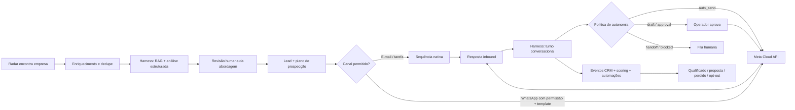

# Prospecção Ativa YUX End-to-End Implementation Plan

> **For agentic workers:** REQUIRED SUB-SKILL: Use superpowers:subagent-driven-development (recommended) or superpowers:executing-plans to implement this plan task-by-task. Steps use checkbox (`- [ ]`) syntax for tracking.

**Goal:** Fechar a jornada operacional de prospecção ativa da YUX, da descoberta e análise de empresas no Radar até a qualificação no CRM, cadências automatizadas e conversas no WhatsApp assistidas ou conduzidas por IA, com aprovação humana, rastreabilidade, limites e compliance.

**Architecture:** O backend TypeScript continua como dono de estado, políticas, filas, CRM, mensagens e efeitos externos. O YUX Agent Harness Runtime continua separado e recebe chamadas síncronas idempotentes, dentro de jobs BullMQ, para produzir resultados estruturados com OpenRouter, Strategy Packs e RAG. Radar, CRM, automações e Omnichannel se conectam pelo transactional outbox já implementado. O primeiro contato é criado como um plano auditável; WhatsApp só é usado quando há permissão registrável e template aprovado, enquanto respostas livres ficam limitadas à janela permitida pelo provedor. O runtime decide entre rascunho, aprovação, envio automático, bloqueio ou handoff, mas somente o backend aplica e envia a decisão.

**Tech Stack:** TypeScript, Fastify, PostgreSQL, BullMQ/Redis, React 18, Tailwind/shadcn, Python 3.12, FastAPI, OpenRouter, Jina AI, Meta WhatsApp Cloud API, SMTP2GO e Vitest/unittest.

**Execution outcome (2026-08-04):** the repository implementation now connects
the governed plan, asynchronous Radar analysis, real Harness contracts, native
CRM e-mail/WhatsApp sequence delivery, inbound WhatsApp AI decisions and Radar
operator controls. The final read-only audit of the separately implemented
Funis, Tasks and Scoring work passed its focused suites without requiring changes
to those modules. The production/Dokploy, migration and real-provider gates in
Task 13 remain deliberately open; therefore this plan must not be read as a
claim that outbound prospecting is already enabled in production. Exact evidence
and remaining operational work are recorded in `docs/implementation-status.md`.

## Global Constraints

- Não recriar Funis, Central de Tarefas, Scoring, outbox, automações, sequências, SMTP2GO, conectores Meta, Omnichannel, Agent Harness ou Radar; terminar e integrar o que já existe.
- Tratar as mudanças locais ainda não consolidadas de `0120`, `0121`, `0122`, funis, tarefas e scoring como trabalho em andamento. Estabilizá-las antes de construir sobre elas.
- Funis, Central de Tarefas e Scoring estão sendo tratados em outra frente. Não modificar essa frente durante as Waves 1–4; executar a Task 1 somente como auditoria de compatibilidade no gate final, após a implementação de prospecção.
- O backend é o único serviço autorizado a persistir estado operacional e disparar mensagens. O runtime Python recomenda; não envia diretamente para Meta, SMTP2GO ou n8n.
- Usar BullMQ como fila operacional de Radar e conversas. Não depender do `agent_queue_jobs` do runtime para os fluxos críticos desta entrega.
- Toda chamada de IA usa `organization_id`, chave de idempotência, timeout, retries limitados, rastreio e resultado validado por schema.
- Nenhum fallback determinístico pode ser apresentado como análise de IA concluída. Ausência de provedor deve gerar `blocked`/`failed` visível e recuperável.
- Primeiro contato de WhatsApp exige número fornecido pelo titular, permissão/opt-in rastreável e Message Template aprovado. Fora da janela de atendimento de 24 horas, somente template aprovado pode ser enviado.
- Opt-out, supressão, bloqueio, política do canal e kill switch prevalecem sobre automações, sequências e decisões do agente.
- Contato frio sem permissão de WhatsApp deve seguir por e-mail permitido, ligação/tarefa humana ou aquisição de opt-in; nunca contornar a política com texto livre.
- A primeira abordagem de uma oportunidade do Radar permanece com revisão humana obrigatória. Autoenvio só pode ser habilitado depois da resposta do contato e por política explícita de autonomia.
- Mensagens com desconto, promessa, compromisso contratual, preço fora de oferta aprovada, dado sensível ou baixa confiança exigem aprovação ou handoff.
- Toda mutation de negócio e seu evento de domínio devem ser gravados na mesma transação PostgreSQL.
- Todos os efeitos externos devem ser idempotentes e manter request/response sanitizados, status, erro seguro, custo e identificador do provedor.
- Dados pessoais devem ser mínimos, ter origem/finalidade/retenção registradas e nunca aparecer em logs de aplicação ou traces do modelo sem sanitização.
- Novas tabelas usam RLS forçada e não concedem acesso a `anon`.
- Cada onda termina com testes automatizados, smoke test operacional e gate explícito antes de liberar a próxima.

---

## Audit Snapshot — 2026-08-04

| Capability | Reuse as-is | Complete/Connect | Current evidence |
|---|---|---|---|
| Radar campaigns, manual/CSV/Jina/CNPJa sources, dedupe, review, opt-out and conversion | Yes | Enable governed sources in production | `backend/src/modules/radar/*`, migrations `0107`–`0110`, `RadarWorkspace.tsx` |
| Radar analysis | No | Replace fixed score/diagnostic/message with Harness job | `runRadarOpportunityAnalysis` currently writes score `72` and canned copy |
| Agent Harness trace, autonomy, profiles, workflows, OpenRouter client and RAG primitives | Yes | Wire them into `StrategyWorkflowEngine` | `Harness.execute_agent` can call OpenRouter, but `workflow.py` does not use it |
| WhatsApp inbound webhook, signature, contact/conversation/message persistence | Yes | Link lead, emit events and apply agent result | `handleInboundMessage` currently calls `/events/ingest` and ignores the later result |
| WhatsApp outbound text | Yes, for open service window | Add template delivery and policy gate | `sendWhatsAppTextMessage` only supports `type: text` |
| Omnichannel queues, handoff, response modes, UI and Meta connection | Yes | Add AI draft/approval/auto-send lifecycle | Existing `conversations`, `messages`, `handoff_events`, workspaces |
| CRM outbox, automation runtime and action handlers | Yes | Add prospecting/conversation events and native messaging actions | Migration `0119`, `backend/src/modules/automation/*` |
| CRM sequences | Yes | Replace WhatsApp n8n fallback with native service | Task and SMTP2GO email are native; WhatsApp still uses signed n8n webhook |
| Funis and stage history | In progress | Stabilize failing route test and land | Local migration `0120` and new pipeline repository/UI |
| Central de Tarefas | In progress | Finish tests and land | Local migration `0121`, repository, route, page and components |
| Scoring by actions | In progress | Stabilize the API/UI being added and consume new events | Local migration `0122`, engine, consumer, routes and frontend are all present as uncommitted work |
| End-to-end prospecting cockpit | No | Add cross-links, plan status, agent decision and recovery | Radar, CRM and Omnichannel are separate workspaces today |

### Verified baseline

- Runtime Python: `66` tests passing.
- Focused frontend suite: `20` tests passing, but no Radar workspace or Task Center component test was discovered by the requested names.
- Focused backend suite initially had `48` passing and `1` failing in `crm-routes.test.ts`. After the in-progress changes advanced, all `10` CRM route assertions passed, but Vitest still exited with an unhandled BullMQ/ioredis `Connection is closed` rejection.
- Backend type-check passes. Frontend type-check currently fails in `ScoringRuleEditor.tsx` because a generic `string` is assigned to the `LeadScoringOperator` state.
- Passing runtime tests prove deterministic contracts and isolated OpenRouter support; they do not prove that production Radar or WhatsApp currently invokes the LLM.

## Target Journey



## Canonical Contracts

```ts
export type ProspectingChannel = 'email' | 'whatsapp' | 'phone' | 'task'

export type ProspectingPolicySnapshot = {
  requireHumanFirstContact: true
  whatsappPermissionRequired: true
  whatsappTemplateRequiredOutsideWindow: true
  dailyLimit: number
  maxAttemptsPerLead: number
  quietHours: { timezone: string; start: string; end: string }
  killSwitch: boolean
}

export type ProspectingPlanStatus =
  | 'draft' | 'approved' | 'active' | 'paused'
  | 'blocked' | 'opted_out' | 'completed' | 'failed'

export type AgentTurnResult = {
  schemaVersion: 1
  runId: string
  reply: { body: string; language: 'pt-BR' }
  classification: {
    intent: string
    stage: string
    sentiment: 'positive' | 'neutral' | 'negative' | 'unknown'
    urgency: 'high' | 'medium' | 'low' | 'none'
    confidence: number
  }
  qualification: {
    fitScoreDelta: number
    intentScoreDelta: number
    objections: string[]
    nextBestAction: string
  }
  policy: {
    mode: 'draft' | 'suggestion' | 'auto_send' | 'approval_required' | 'handoff' | 'blocked'
    reason: string
    requiresApproval: boolean
    shouldSend: boolean
    shouldHandoff: boolean
  }
  trace: { supportingCardIds: string[]; model: string; inputHash: string }
}
```

New event types:

- `radar.analysis_requested`
- `radar.analysis_completed`
- `radar.analysis_failed`
- `prospecting.plan_approved`
- `prospecting.started`
- `prospecting.contact_attempted`
- `prospecting.contact_blocked`
- `prospecting.replied`
- `prospecting.opted_out`
- `conversation.message_received`
- `conversation.ai_draft_created`
- `conversation.message_approved`
- `conversation.message_sent`
- `conversation.handoff_requested`
- `lead.qualified`

---

## Final Integration Audit — Deferred Until the Prospecting Implementation Is Complete

### Task 1: Finish and land the in-progress Funis, Tasks and Scoring foundation

**Execution status:** Deferred by product direction. During this implementation, do not edit these files. At the final gate, re-audit their then-current state, run the listed tests and change only what remains incompatible with the completed prospecting journey.

**Files:**
- Modify: `backend/src/db/migrations/0120_crm_pipeline_management.sql`
- Modify: `backend/src/db/migrations/0121_crm_task_center.sql`
- Modify: `backend/src/db/migrations/0122_lead_scoring_rules.sql`
- Modify: `backend/src/modules/crm/pipeline-repository.ts`
- Modify: `backend/src/modules/crm/task-repository.ts`
- Modify: `backend/src/modules/crm/scoring-repository.ts`
- Modify: `backend/src/modules/crm/scoring-engine.ts`
- Modify: `backend/src/modules/crm/routes.ts`
- Modify: `frontend/src/pages/client-portal/commercial/PortalCommercialFunnelsPage.tsx`
- Modify: `frontend/src/pages/client-portal/commercial/PortalCommercialTasksPage.tsx`
- Modify: `frontend/src/pages/client-portal/commercial/PortalLeadScoringPage.tsx`
- Test: `backend/tests/crm-routes.test.ts`
- Test: `backend/tests/crm-scoring.test.ts`
- Test: `frontend/src/pages/client-portal/commercial/PortalCommercialTasksPage.test.tsx`

- [ ] **Step 1: Preserve the working tree and capture the exact diff**

Run: `git status --short && git diff --check && git diff --stat`

Expected: only intended CRM/doc changes are carried into this task; unrelated user files remain untouched.

- [ ] **Step 2: Reproduce the current stage-move failure**

Run: `cd backend && npm test -- --run tests/crm-routes.test.ts -t "returns pipelines, moves leads"`

Expected: FAIL with the current `500` response before the route/repository contract is corrected.

- [ ] **Step 3: Make stage movement and its event use one transaction**

Keep the repository contract queryable by both `pg.Pool` and `pg.PoolClient`, and ensure `lead_stage_history` plus `lead.stage_changed` are written before commit.

```ts
export async function moveLeadToStage(
  pool: pg.Pool,
  user: AuthUser,
  leadId: string,
  input: { organizationId: string; crmInstanceId: string; stageId: string },
): Promise<CrmLead>
```

- [ ] **Step 4: Finish Task Center transitions and scoring API/UI**

Expose active model, rules, simulation and score history under `/api/crm/scoring/*`; keep task transitions `pending -> completed|cancelled` and reopen explicit and evented.

Correct the `ScoringRuleEditor.tsx` operator change handler so only `'' | LeadScoringOperator` reaches state, and close/replace the test BullMQ connection without leaving an unhandled ioredis rejection.

- [ ] **Step 5: Run the focused CRM verification**

Run: `cd backend && npm test -- --run tests/schema-smoke.test.ts tests/crm-routes.test.ts tests/crm-scoring.test.ts tests/domain-event-outbox.test.ts`

Run: `cd frontend && npm test -- --run src/pages/client-portal/commercial/PortalCommercialFunnelsPage.test.tsx src/pages/client-portal/commercial/PortalCommercialTasksPage.test.tsx src/services/crmService.test.ts`

Expected: PASS.

- [ ] **Step 6: Commit the stabilized foundation**

```bash
git add backend/src/db/migrations/0120_crm_pipeline_management.sql backend/src/db/migrations/0121_crm_task_center.sql backend/src/db/migrations/0122_lead_scoring_rules.sql backend/src/modules/crm backend/src/jobs/handlers/crm-scoring.ts backend/src/jobs/handlers/domain-events.ts backend/src/modules/events/catalog.ts backend/tests frontend/src/components/crm/funnels frontend/src/components/crm/tasks frontend/src/pages/client-portal/commercial frontend/src/services/crmService.ts frontend/src/types/crm.ts frontend/src/hooks/usePortalCrmContext.ts
git commit -m "feat: stabilize crm funnels tasks and scoring"
```

**Gate:** do not start Wave 1 until backend and frontend focused suites pass and migrations `0120`–`0122` apply cleanly to an empty and an upgraded database.

---

## Wave 1 — Prospecting State and Real Agent Analysis

### Task 2: Add the prospecting policy, plan and consent ledger

**Files:**
- Create: `backend/src/db/migrations/0123_active_prospecting_orchestration.sql`
- Create: `backend/src/modules/prospecting/types.ts`
- Create: `backend/src/modules/prospecting/repository.ts`
- Modify: `backend/tests/schema-smoke.test.ts`
- Create: `backend/tests/prospecting-repository.test.ts`

- [ ] **Step 1: Write failing schema assertions**

```ts
expect(migration).toContain('CREATE TABLE public.prospecting_policies')
expect(migration).toContain('CREATE TABLE public.prospecting_plans')
expect(migration).toContain('CREATE TABLE public.lead_channel_permissions')
expect(migration).toContain('UNIQUE (organization_id, channel, address)')
```

- [ ] **Step 2: Run the schema test and verify failure**

Run: `cd backend && npm test -- --run tests/schema-smoke.test.ts`

- [ ] **Step 3: Create policy and plan tables**

```sql
CREATE TABLE public.prospecting_plans (
  id UUID PRIMARY KEY DEFAULT gen_random_uuid(),
  organization_id UUID NOT NULL REFERENCES public.organizations(id) ON DELETE CASCADE,
  crm_instance_id UUID NOT NULL REFERENCES public.crm_instances(id) ON DELETE CASCADE,
  radar_opportunity_id UUID NOT NULL REFERENCES public.radar_opportunities(id) ON DELETE CASCADE,
  lead_id UUID REFERENCES public.leads(id) ON DELETE SET NULL,
  sequence_id UUID REFERENCES public.crm_sequences(id) ON DELETE SET NULL,
  conversation_id UUID REFERENCES public.conversations(id) ON DELETE SET NULL,
  primary_channel TEXT NOT NULL CHECK (primary_channel IN ('email','whatsapp','phone','task')),
  status TEXT NOT NULL DEFAULT 'draft' CHECK (status IN ('draft','approved','active','paused','blocked','opted_out','completed','failed')),
  policy_snapshot JSONB NOT NULL DEFAULT '{}'::JSONB,
  idempotency_key TEXT NOT NULL UNIQUE,
  approved_by UUID REFERENCES public.users(id) ON DELETE SET NULL,
  approved_at TIMESTAMPTZ,
  created_at TIMESTAMPTZ NOT NULL DEFAULT NOW(),
  updated_at TIMESTAMPTZ NOT NULL DEFAULT NOW(),
  UNIQUE (radar_opportunity_id)
);
```

`lead_channel_permissions` must record `channel`, normalized address, state (`granted`, `revoked`, `unknown`), source, notice/version, evidence JSON, actor and timestamp. Keep `leads.whatsapp_opt_in`/`email_opt_in` as cached compatibility fields, not source of truth.

- [ ] **Step 4: Extend existing Radar structures instead of duplicating them**

Add `run_kind` to `radar_enrichment_runs`, allow provider `yux_agent_runtime`, and extend `radar_outreach_events.event_type` with planned/queued/sent/delivered/read/replied/failed/blocked lifecycle values.

- [ ] **Step 5: Implement policy resolution and suppression checks**

```ts
export async function resolveProspectingEligibility(
  client: Queryable,
  input: { organizationId: string; leadId: string; channel: ProspectingChannel; now: Date },
): Promise<{ allowed: boolean; blockedReasons: string[]; policy: ProspectingPolicySnapshot }>
```

- [ ] **Step 6: Test cross-tenant isolation, permission revocation and kill switch**

Run: `cd backend && npm test -- --run tests/prospecting-repository.test.ts tests/schema-smoke.test.ts`

Expected: PASS.

- [ ] **Step 7: Commit**

```bash
git add backend/src/db/migrations/0123_active_prospecting_orchestration.sql backend/src/modules/prospecting backend/tests
git commit -m "feat: add governed prospecting state"
```

### Task 3: Make the Harness execute real OpenRouter + Strategy RAG workflows

**Files:**
- Create: `workers/marketing-studio-agent-runtime/yux_agent_runtime/contracts.py`
- Create: `workers/marketing-studio-agent-runtime/yux_agent_runtime/runtime_factory.py`
- Modify: `workers/marketing-studio-agent-runtime/yux_agent_runtime/api.py`
- Modify: `workers/marketing-studio-agent-runtime/yux_agent_runtime/workflow.py`
- Modify: `workers/marketing-studio-agent-runtime/yux_agent_runtime/harness.py`
- Modify: `workers/marketing-studio-agent-runtime/yux_agent_runtime/retrieval.py`
- Create: `workers/marketing-studio-agent-runtime/tests/test_live_workflows.py`

- [ ] **Step 1: Write failing workflow tests that prove the provider is called**

```py
def test_radar_workflow_calls_openrouter_and_returns_valid_contract(self):
    result = engine.execute(message="Analise Empresa X", mode="commercial_radar_local_niche", source="radar", organization_id=ORG)
    self.assertEqual(transport.calls, 1)
    self.assertEqual(result["synthesis"]["schema_version"], 1)
    self.assertIn("score", result["synthesis"])

def test_whatsapp_turn_uses_history_rag_and_autonomy_policy(self):
    self.assertEqual(result["synthesis"]["reply"]["language"], "pt-BR")
    self.assertIn(result["policy"]["autonomy_mode"], ALLOWED_MODES)
```

- [ ] **Step 2: Run and verify the tests fail because `workflow.py` does not use `Harness`**

Run: `cd workers/marketing-studio-agent-runtime && python -m unittest tests.test_live_workflows -v`

- [ ] **Step 3: Build runtime dependencies from PostgreSQL**

`runtime_factory.py` must adapt `PostgresAgentRuntimeStore.list/insert` to `StrategyRetrievalService`, load the active profile, prompt, model route, workflow spec, autonomy policies and instantiate `Harness(..., llm_client=OpenRouterClient.from_env())`.

- [ ] **Step 4: Execute one real conversational agent and real Radar subagents**

For `whatsapp_conversation_turn`, use one SDR agent call with the recent conversation history and retrieved context. For Radar, execute the configured subagents and a final synthesizer. Set `execute_llm=True`; a missing API key must fail with `missing_openrouter_api_key`, not return dry-run content.

- [ ] **Step 5: Validate structured JSON and reject hallucinated evidence**

Use Pydantic contracts with `extra='forbid'`, clamp scores/confidence, require every evidence identifier to exist in retrieved context, and retry invalid JSON once with the verifier prompt.

- [ ] **Step 6: Load workflow/policy/RAG server-side**

Callers may provide company or conversation facts, but may not supply arbitrary autonomy policies, model routes or privileged internal context. `api.py` resolves those from the database using the tenant context.

- [ ] **Step 7: Run all runtime tests**

Run: `cd workers/marketing-studio-agent-runtime && python -m unittest discover -s tests -v`

Expected: existing `66` tests plus new live-workflow contract tests PASS using a fake transport.

- [ ] **Step 8: Commit**

```bash
git add workers/marketing-studio-agent-runtime/yux_agent_runtime workers/marketing-studio-agent-runtime/tests
git commit -m "feat: execute real harness workflows with rag"
```

### Task 4: Replace Radar canned analysis with an asynchronous Harness job

**Files:**
- Create: `backend/src/modules/radar/analysis-service.ts`
- Create: `backend/src/jobs/handlers/radar.ts`
- Modify: `backend/src/modules/radar/routes.ts`
- Modify: `backend/src/modules/radar/repository.ts`
- Modify: `backend/src/modules/radar/types.ts`
- Modify: `backend/src/jobs/queue.ts`
- Modify: `backend/src/worker.ts`
- Modify: `backend/src/modules/events/catalog.ts`
- Create: `backend/tests/radar-agent-analysis.test.ts`

- [ ] **Step 1: Write a failing route/job test**

Assert `POST /api/radar/opportunities/:id/run-analysis` returns `202`, creates one `running` analysis run, queues `radar.analyzeOpportunity`, and a duplicate request returns the same active run.

- [ ] **Step 2: Run the test and verify failure**

Run: `cd backend && npm test -- --run tests/radar-agent-analysis.test.ts`

- [ ] **Step 3: Add the queue contract**

```ts
export type RadarAnalyzeOpportunityJob = {
  opportunityId: string
  organizationId: string
  requestedBy: string
  analysisRunId: string
  idempotencyKey: string
}
```

- [ ] **Step 4: Build the trusted Harness request**

Load company, campaign, enrichment evidence and strategy profile from PostgreSQL. Invoke `/workflows/execute` with `source: 'radar'`, `mode: 'commercial_radar_local_niche'` and facts only.

- [ ] **Step 5: Persist the validated result transactionally**

Insert `radar_diagnostics`, `radar_scores`, `radar_message_suggestions`, update latest IDs/status, link `agent_execution_run_id`, append Radar lifecycle entries and record `radar.analysis_completed`. On error, mark run `failed`, preserve the previous good analysis and record `radar.analysis_failed`.

- [ ] **Step 6: Delete the canned business result**

Remove the fixed score `72`, fixed pain hypothesis, fixed offer and canned message from `runRadarOpportunityAnalysis`. Keep only queue orchestration and result persistence.

- [ ] **Step 7: Test timeout, invalid schema, duplicate and retry**

Run: `cd backend && npm test -- --run tests/radar-routes.test.ts tests/radar-agent-analysis.test.ts tests/domain-event-outbox.test.ts`

Expected: PASS.

- [ ] **Step 8: Commit**

```bash
git add backend/src/modules/radar backend/src/jobs backend/src/worker.ts backend/src/modules/events/catalog.ts backend/tests
git commit -m "feat: connect radar analysis to agent harness"
```

---

## Wave 2 — Convert Approval into a Governed Cadence

### Task 5: Create an atomic “approve and start prospecting” command

**Files:**
- Create: `backend/src/modules/prospecting/service.ts`
- Create: `backend/src/modules/prospecting/routes.ts`
- Modify: `backend/src/modules/radar/repository.ts`
- Modify: `backend/src/server.ts`
- Modify: `backend/src/modules/events/types.ts`
- Create: `backend/tests/prospecting-routes.test.ts`

- [ ] **Step 1: Write failing command tests**

Cover: approved opportunity creates/reuses one lead, creates one plan, records policy snapshot and `prospecting.plan_approved`; opted-out or unapproved opportunities return `409`; duplicate idempotency key returns the same plan.

- [ ] **Step 2: Extract lead conversion into a transaction-compatible command**

```ts
export async function ensureRadarLead(
  client: Queryable,
  input: { opportunityId: string; actorId: string },
): Promise<{ leadId: string; created: boolean }>
```

`convertRadarOpportunityToLead` and the prospecting service must call this shared command instead of opening nested transactions or duplicating conversion SQL.

- [ ] **Step 3: Add the start endpoint**

`POST /api/prospecting/radar/:opportunityId/start` accepts `channel`, `sequenceId`, optional `whatsappTemplateId` and `idempotencyKey`. It resolves eligibility before writing `active`; otherwise writes `blocked` with reasons.

- [ ] **Step 4: Enroll allowed plans through existing CRM sequence code**

Use `enrollLeadInSequence`/domain commands. Do not write sequence enrollment rows from the route. Emit `prospecting.started` after the enrollment is committed.

- [ ] **Step 5: Test rollback and fan-out**

Run: `cd backend && npm test -- --run tests/prospecting-routes.test.ts tests/domain-event-outbox.test.ts tests/automation-dispatch.test.ts`

- [ ] **Step 6: Commit**

```bash
git add backend/src/modules/prospecting backend/src/modules/radar/repository.ts backend/src/server.ts backend/tests
git commit -m "feat: start approved prospecting plans atomically"
```

### Task 6: Implement native Meta WhatsApp template delivery

**Files:**
- Modify: `backend/src/lib/edge-compat/whatsappProvider.ts`
- Create: `backend/src/modules/omnichannel/whatsapp-delivery.ts`
- Modify: `backend/src/jobs/handlers/omnichannel.ts`
- Modify: `backend/src/modules/omnichannel/repository.ts`
- Create: `backend/tests/whatsapp-delivery.test.ts`
- Modify: `backend/tests/edge-compat/omnichannel.test.ts`

- [ ] **Step 1: Write failing payload and policy tests**

```ts
expect(buildWhatsAppTemplatePayload(input)).toEqual({
  messaging_product: 'whatsapp',
  to: '5511999999999',
  type: 'template',
  template: { name: 'yux_primeiro_contato', language: { code: 'pt_BR' }, components: expect.any(Array) },
})
```

Also assert that first contact without granted permission, approved template or active connection returns `prospecting_whatsapp_blocked` before any provider request.

- [ ] **Step 2: Add template support beside text support**

```ts
export async function sendWhatsAppMessage(input: WhatsAppSendInput & (
  | { kind: 'text'; body: string }
  | { kind: 'template'; templateName: string; languageCode: string; components: WhatsAppTemplateComponent[] }
))
```

- [ ] **Step 3: Centralize contact, conversation and outbound-message creation**

`ensureLeadWhatsAppConversation` normalizes phone, reuses/creates `omnichannel_contacts`, links `lead_id`, creates `lead_conversation_links`, selects the approved Meta connection and returns a conversation.

- [ ] **Step 4: Enforce window and template rules server-side**

Track last inbound timestamp from `messages`. Initial/out-of-window delivery must be `template`; in-window follow-up may be `text`. Provider status webhooks update the same message and outreach event.

- [ ] **Step 5: Run tests**

Run: `cd backend && npm test -- --run tests/whatsapp-delivery.test.ts tests/edge-compat/omnichannel.test.ts tests/omnichannel-routes.test.ts`

- [ ] **Step 6: Commit**

```bash
git add backend/src/lib/edge-compat/whatsappProvider.ts backend/src/modules/omnichannel backend/src/jobs/handlers/omnichannel.ts backend/tests
git commit -m "feat: send governed whatsapp templates natively"
```

### Task 7: Make CRM sequences and automations use native messaging services

**Files:**
- Modify: `backend/src/modules/crm/scheduler.ts`
- Modify: `backend/src/modules/automation/command-adapters.ts`
- Modify: `backend/src/modules/automation/action-handlers.ts`
- Create: `backend/src/modules/messaging/service.ts`
- Modify: `backend/tests/crm-scheduler.test.ts`
- Modify: `backend/tests/automation-dispatch.test.ts`

- [ ] **Step 1: Write failing tests proving no n8n call for core messaging**

Test `whatsapp` sequence execution, `send_whatsapp`, `send_email` and `ai_generate_message`. The first two must create internal delivery records/jobs; email must use `queueEmailRequest`; AI message generation must call the Harness and return a draft.

- [ ] **Step 2: Add sequence step metadata**

Extend `crm_sequence_steps` with JSONB metadata in migration `0123` for `templateId`, variables, permission category, fallback channel and stop conditions.

- [ ] **Step 3: Route native actions**

Keep n8n only for explicit `webhook`/`call_api` actions. `send_email`, `send_whatsapp` and `ai_generate_message` must use typed internal services and preserve the automation idempotency key.

- [ ] **Step 4: Stop cadence on reply, opt-out, conversion or hard failure**

Consume `prospecting.replied`, `prospecting.opted_out`, won/lost stage and permanent provider failure events to pause or complete the enrollment.

- [ ] **Step 5: Run tests**

Run: `cd backend && npm test -- --run tests/crm-scheduler.test.ts tests/automation-dispatch.test.ts tests/domain-event-outbox.test.ts`

- [ ] **Step 6: Commit**

```bash
git add backend/src/modules/crm/scheduler.ts backend/src/modules/automation backend/src/modules/messaging backend/tests
git commit -m "feat: use native messaging in sequences and automations"
```

**Gate:** before Wave 3, a sandbox lead with explicit WhatsApp permission must receive one approved template through the Meta test number, and a blocked lead must produce zero Meta requests.

---

## Wave 3 — AI Conversation Loop and CRM Feedback

### Task 8: Turn inbound WhatsApp messages into an idempotent agent job

**Files:**
- Modify: `backend/src/jobs/handlers/omnichannel.ts`
- Create: `backend/src/modules/omnichannel/agent-turn-service.ts`
- Modify: `backend/src/modules/events/catalog.ts`
- Modify: `backend/src/modules/events/types.ts`
- Create: `backend/tests/omnichannel-agent-turn.test.ts`

- [ ] **Step 1: Write failing inbound integration tests**

Assert inbound persistence, phone-based lead/conversation link, one `conversation.message_received` event, one Harness call with recent history, and duplicate webhook idempotency.

- [ ] **Step 2: Replace `/events/ingest` with direct workflow execution inside BullMQ**

`handleInboundMessage` is already a retryable worker job. After persisting the inbound message, call `/workflows/execute` synchronously with `source: 'whatsapp'`, `mode: 'conversation_turn'`, lead facts and the last 20 sanitized messages.

- [ ] **Step 3: Resolve the lead safely**

Match normalized phone inside the same organization. Auto-link only an unambiguous match; otherwise keep the conversation unlinked, create a suggested link and request human review.

- [ ] **Step 4: Persist the agent result and CRM insight**

Write `ai_message_runs`, `lead_ai_insights`, score suggestions, objections and `conversation.ai_draft_created`. Store the runtime run ID and input hash; never store full protected prompts in ordinary logs.

- [ ] **Step 5: Run tests**

Run: `cd backend && npm test -- --run tests/omnichannel-agent-turn.test.ts tests/omnichannel-routes.test.ts tests/domain-event-outbox.test.ts`

- [ ] **Step 6: Commit**

```bash
git add backend/src/jobs/handlers/omnichannel.ts backend/src/modules/omnichannel/agent-turn-service.ts backend/src/modules/events backend/tests
git commit -m "feat: process whatsapp replies through agent harness"
```

### Task 9: Apply autonomy decisions as draft, auto-send, block or handoff

**Files:**
- Modify: `backend/src/modules/omnichannel/agent-turn-service.ts`
- Modify: `backend/src/modules/omnichannel/repository.ts`
- Modify: `backend/src/modules/omnichannel/routes.ts`
- Modify: `backend/src/jobs/handlers/omnichannel.ts`
- Create: `backend/tests/omnichannel-autonomy.test.ts`

- [ ] **Step 1: Write a test matrix for all autonomy modes**

| Mode | Persist | Dispatch | Conversation status |
|---|---|---|---|
| `draft` / `suggestion` | response suggestion | no | `waiting_human` or `open` |
| `approval_required` | outbound draft + approval record | only after approval | `waiting_human` |
| `auto_send` | outbound AI message | yes, once | `waiting_ai` then `open` |
| `handoff` | insight + handoff event | no | `waiting_human`/`manual` |
| `blocked` | safe reason | no | unchanged or `waiting_human` |

- [ ] **Step 2: Enforce backend-side guards after the model decision**

Re-check response mode, business hours, max auto-sends, permission, service window, opt-out, risk flags, confidence and kill switch. A model `shouldSend=true` is advisory, never sufficient by itself.

- [ ] **Step 3: Implement approval and rejection endpoints**

`POST /api/omnichannel/ai-suggestions/:id/approve` creates one outbound message and queues dispatch; `reject` records reviewer and reason. Both emit domain events.

- [ ] **Step 4: Add stop/qualification events**

An inbound reply emits `prospecting.replied`; qualification above configured threshold emits `lead.qualified`; explicit stop language revokes permission and emits `prospecting.opted_out` before any reply is queued.

- [ ] **Step 5: Run tests**

Run: `cd backend && npm test -- --run tests/omnichannel-autonomy.test.ts tests/omnichannel-agent-turn.test.ts tests/automation-dispatch.test.ts tests/crm-scoring.test.ts`

- [ ] **Step 6: Commit**

```bash
git add backend/src/modules/omnichannel backend/src/jobs/handlers/omnichannel.ts backend/tests
git commit -m "feat: enforce ai conversation autonomy and handoff"
```

### Task 10: Feed conversation outcomes into CRM scoring and automation

**Files:**
- Modify: `backend/src/modules/events/dispatcher.ts`
- Modify: `backend/src/jobs/handlers/crm-scoring.ts`
- Modify: `backend/src/modules/crm/scoring-engine.ts`
- Modify: `backend/src/modules/crm/scoring-repository.ts`
- Modify: `backend/src/modules/automation/runtime.ts`
- Modify: `backend/tests/crm-scoring.test.ts`
- Create: `backend/tests/automation-runtime.test.ts`

- [ ] **Step 1: Add failing scoring tests for reply, objection and qualification**

Use event rules rather than hard-coded score deltas. Verify each rule/event pair is applied once and threshold events fan out to all matching automations.

- [ ] **Step 2: Add safe event payload fields**

Expose classification, confidence, consent state, attempt count and non-sensitive objection category. Do not put raw message text into the general outbox payload.

- [ ] **Step 3: Add default YUX prospecting rules as editable seed data**

Examples: valid business fit, first reply, explicit interest, meeting request, objection, opt-out and repeated no-response. Mark them as defaults for the internal YUX CRM only.

- [ ] **Step 4: Test the loop guard**

Ensure `lead.score_changed -> automation -> task/stage -> scoring` respects correlation, depth and re-entry controls from migration `0119`.

- [ ] **Step 5: Run tests and commit**

Run: `cd backend && npm test -- --run tests/crm-scoring.test.ts tests/automation-runtime.test.ts tests/domain-event-outbox.test.ts`

```bash
git add backend/src/modules/events backend/src/jobs/handlers/crm-scoring.ts backend/src/modules/crm/scoring-* backend/src/modules/automation/runtime.ts backend/tests
git commit -m "feat: connect conversation outcomes to crm automation"
```

---

## Wave 4 — Operator Experience, Governance and Deployment

### Task 11: Connect the Radar, CRM and Omnichannel frontends

**Files:**
- Modify: `frontend/src/types/radar.ts`
- Modify: `frontend/src/services/radarService.ts`
- Modify: `frontend/src/components/radar/RadarWorkspace.tsx`
- Create: `frontend/src/components/radar/ProspectingPlanPanel.tsx`
- Modify: `frontend/src/types/omnichannel.ts`
- Modify: `frontend/src/services/omnichannelService.ts`
- Modify: `frontend/src/components/omnichannel/ConversationDetails.tsx`
- Create: `frontend/src/components/omnichannel/AiReplyDecisionCard.tsx`
- Modify: `frontend/src/components/crm/Lead360Panel.tsx`
- Create: `frontend/src/components/crm/LeadProspectingTimeline.tsx`
- Create: `frontend/src/components/radar/RadarWorkspace.test.tsx`
- Create: `frontend/src/components/radar/ProspectingPlanPanel.test.tsx`
- Create: `frontend/src/components/omnichannel/AiReplyDecisionCard.test.tsx`

- [ ] **Step 1: Write failing UI journey tests**

Cover queued/running/failed Radar analysis, approved plan preview, blocked WhatsApp reason, allowed fallback channel, lead/conversation cross-link, AI approval/rejection and handoff.

- [ ] **Step 2: Poll analysis status without duplicate jobs**

`runAnalysis` consumes a `202` run resource; the workspace polls the run until terminal state and exposes retry only for `failed`.

- [ ] **Step 3: Add the plan preview and explicit approval**

Show channel, template, sequence steps, evidence, permission state, quiet hours, limits and exact reason when a channel is blocked. Starting a plan requires a confirmation dialog.

- [ ] **Step 4: Add AI decision controls in Omnichannel**

Display draft, evidence summary, confidence, policy reason and buttons to approve, edit, reject or handoff. Never expose chain-of-thought or raw internal RAG chunks.

- [ ] **Step 5: Add Lead 360 prospecting timeline**

Combine Radar origin, plan, attempts, delivery, replies, score changes, tasks, conversation and qualification events with links back to the source workspaces.

- [ ] **Step 6: Run frontend tests**

Run: `cd frontend && npm test -- --run src/components/radar/RadarWorkspace.test.tsx src/components/radar/ProspectingPlanPanel.test.tsx src/components/omnichannel/AiReplyDecisionCard.test.tsx src/components/omnichannel/OmnichannelWorkspace.test.tsx src/components/crm/LeadWhatsappAiPanels.test.tsx`

Run: `cd frontend && npm run type-check`

- [ ] **Step 7: Commit**

```bash
git add frontend/src/types frontend/src/services frontend/src/components/radar frontend/src/components/omnichannel frontend/src/components/crm
git commit -m "feat: connect prospecting operator journey"
```

### Task 12: Add compliance, observability and operational controls

**Files:**
- Create: `backend/src/modules/prospecting/metrics.ts`
- Modify: `backend/src/modules/prospecting/routes.ts`
- Modify: `backend/src/modules/omnichannel/routes.ts`
- Modify: `frontend/src/components/radar/ProspectingPlanPanel.tsx`
- Create: `frontend/src/components/radar/ProspectingOperationsPanel.tsx`
- Create: `backend/tests/prospecting-governance.test.ts`
- Modify: `docs/omnichannel-ai-operations.md`
- Create: `docs/active-prospecting-operations.md`

- [ ] **Step 1: Write failing governance tests**

Cover global/org/campaign kill switch, quiet hours, daily and per-lead limits, opt-out before dispatch, stale permission, template rejection, provider quality block, retention and safe logs.

- [ ] **Step 2: Add auditable operational metrics**

Expose discovered, analyzed, approved, blocked, contacted, delivered, replied, qualified, opted-out, handoff, provider failure, average cost and conversion by source/channel/template/model.

- [ ] **Step 3: Add recovery controls**

Operators can pause campaign/plan, retry only retryable failures, change fallback channel, revoke permission, force handoff and inspect sanitized provider/agent trace IDs.

- [ ] **Step 4: Implement retention and deletion jobs**

Expire raw source data and unconverted cold-prospect data according to `retention_until`; retain minimum audit facts and hashed suppression identifiers required to honor opt-out.

- [ ] **Step 5: Complete the legal/provider gate**

Before production enablement, record YUX legal review of the ANPD legitimate-interest balancing test and current WhatsApp Business Messaging Policy. The system must link the policy version in the prospecting policy snapshot.

Reference: [ANPD — Guia de legítimo interesse](https://www.gov.br/anpd/pt-br/centrais-de-conteudo/materiais-educativos-e-publicacoes/guia_orientativo_hipoteses_legais_tratamento_de_dados_pessoais_legitimo_interesse) and [WhatsApp Business Messaging Policy](https://whatsappbusiness.com/policy/).

- [ ] **Step 6: Run tests and commit**

Run: `cd backend && npm test -- --run tests/prospecting-governance.test.ts tests/whatsapp-delivery.test.ts`

```bash
git add backend/src/modules/prospecting backend/src/modules/omnichannel frontend/src/components/radar docs/active-prospecting-operations.md docs/omnichannel-ai-operations.md backend/tests
git commit -m "feat: add prospecting governance and operations"
```

### Task 13: Verify the full journey and deploy progressively in Dokploy

**Files:**
- Create: `backend/tests/active-prospecting-e2e.test.ts`
- Create: `frontend/src/pages/client-portal/commercial/PortalActiveProspectingJourney.test.tsx`
- Modify: `docker-compose.dokploy.yml`
- Modify: `backend/.env.example`
- Modify: `DEPLOY-DOKPLOY-VPS.md`
- Modify: `docs/backend-vps-runbook.md`
- Modify: `docs/implementation-status.md`

- [ ] **Step 1: Create a hermetic backend E2E test**

Use fake OpenRouter, Jina, SMTP2GO and Meta transports. Exercise: Radar candidate -> analysis -> human approval -> lead/plan -> first contact -> inbound reply -> agent draft/auto-send -> score -> stage/task -> opt-out. Assert idempotency at every retry point.

- [ ] **Step 2: Run all code verification**

Run: `cd backend && npm test && npm run type-check && npm run build`

Run: `cd frontend && npm test && npm run lint && npm run type-check && npm run build`

Run: `cd workers/marketing-studio-agent-runtime && python -m unittest discover -s tests -v`

Expected: all PASS.

- [ ] **Step 3: Validate migrations and Compose**

Run: `cd backend && npm run migrate`

Run: `docker compose -f docker-compose.dokploy.yml config`

Run: `docker compose -f docker-compose.dokploy.yml build`

Expected: migrations `0120`–`0123` apply once and no service starts without required runtime/database secrets.

- [ ] **Step 4: Deploy with feature flags off**

Add `ACTIVE_PROSPECTING_ENABLED`, `RADAR_AGENT_ANALYSIS_ENABLED`, `WHATSAPP_PROSPECTING_ENABLED` and `WHATSAPP_AI_AUTO_SEND_ENABLED`. Deploy schema/code with all outbound flags false; verify health, migrations, worker, runtime and webhook signatures.

- [ ] **Step 5: Canary in four gates**

1. Internal YUX organization: Radar real analysis, no outbound.
2. Human-approved email/task cadence.
3. Meta sandbox/test number with permission and approved template.
4. Assisted AI replies; only then enable `auto_send` for low-risk in-window replies and a small daily cap.

Rollback is flag-off plus queue pause; it must not require schema rollback.

- [ ] **Step 6: Run production smoke checklist**

- One Radar opportunity produces a real agent run/model ID and evidence-linked analysis.
- Duplicate analysis click creates no duplicate active run.
- Blocked cold WhatsApp creates no provider request.
- Approved template reaches the Meta test recipient and webhook updates sent/delivered/read.
- Inbound reply links to the lead, creates one insight and one draft/response.
- Approval dispatches once; retry does not duplicate.
- Opt-out pauses enrollment and blocks future channels according to policy.
- Handoff changes response mode to manual and appears in the operator queue.
- CRM score, task and stage automation update with the same correlation ID.

- [ ] **Step 7: Update implementation status with measured evidence**

Only mark the end-to-end feature implemented after the production smoke passes. Record exact test counts, enabled flags, provider configuration and remaining policy limitations.

- [ ] **Step 8: Commit**

```bash
git add backend/tests/active-prospecting-e2e.test.ts frontend/src/pages/client-portal/commercial/PortalActiveProspectingJourney.test.tsx docker-compose.dokploy.yml backend/.env.example DEPLOY-DOKPLOY-VPS.md docs/backend-vps-runbook.md docs/implementation-status.md
git commit -m "test: verify active prospecting end to end"
```

---

## Definition of Done

- Radar analysis invokes the configured OpenRouter model through the Harness, uses tenant-safe RAG, stores trace/model/cost and never returns canned content as a successful AI run.
- An approved Radar opportunity becomes exactly one lead and one governed prospecting plan, with one idempotent sequence enrollment.
- Core email and WhatsApp effects no longer require n8n; n8n remains available only for explicit custom integrations.
- Initial WhatsApp contact is impossible without permission, approved template, active Meta connection, limits and non-blocked policy.
- An inbound WhatsApp reply is persisted, linked, analyzed and converted into exactly one draft, auto-reply, block or handoff according to backend-enforced policy.
- Operator can see and control the complete journey from Radar through CRM and Omnichannel.
- Reply, qualification, opt-out, delivery and handoff events feed scoring and automations without loops or duplicate effects.
- Full backend, frontend and runtime suites pass; migrations and Dokploy Compose validate; sandbox and production canary smoke checks pass.
- `docs/implementation-status.md` states the real production state and flags, not merely repository presence.

## Explicit Non-Goals for This Delivery

- Buying or scraping private personal-contact datasets.
- Bypassing WhatsApp templates, permission requirements, quality limits or account enforcement.
- Letting the model make contractual commitments, approve discounts or alter proposals autonomously.
- Replacing the existing CRM, automation builder, outbox, Omnichannel or Agent Harness with a second stack.
- Enabling high-volume auto-send before measured canary results and legal/provider approval.
