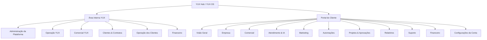

# YUX Navigation Product Architecture Design

## Objetivo

Reorganizar a arquitetura de navegação do YUX Hub / Portal YUX em torno das jornadas reais de uso, separando com clareza:

- administração e operação interna da YUX;
- operação comercial própria da YUX;
- gestão dos clientes e contratos;
- operação dos módulos contratados pelos clientes;
- portal do cliente como produto completo.

O objetivo não é apenas renomear menus. A mudança deve fazer o produto parecer mais coerente, vendável e fácil de operar, reduzindo a exposição de conceitos técnicos como `Omnichannel`, `CRM Governance`, `Knowledge Source` e agrupamentos baseados na origem técnica dos módulos.

## Problema Atual

O mapa atual mostra um sistema com muitos recursos reais, mas organizado de forma confusa:

- a navegação mistura operação interna, funcionalidades comerciais, infraestrutura/admin e portal do cliente;
- áreas críticas ficam escondidas em abas internas, especialmente CRM, Automações, Omnichannel e Marketing Studio;
- o portal do cliente ainda parece uma coleção de módulos contratados, não um produto final;
- algumas páginas têm nomes orientados ao backend ou à arquitetura técnica, não ao trabalho do usuário;
- o cliente não tem uma área forte de Empresa, Usuários, Base de Conhecimento, Marca/Tom de Voz e Integrações próprias.

O novo desenho organiza o sistema por jornada de trabalho.

## Princípios de Produto

1. **Separar interno YUX de portal do cliente**

   A equipe YUX precisa administrar plataforma, clientes, contratos, operação e módulos. O cliente precisa usar um produto claro para gerir comercial, atendimento, marketing, automações, projetos, relatórios, suporte e financeiro.

2. **Organizar por trabalho real do usuário**

   Cliente não pensa em "Omnichannel"; pensa em "Atendimento & IA". Cliente não pensa em "Knowledge Source"; pensa em "Base de Conhecimento da minha empresa". Cliente não pensa em "Marketing Studio com subabas"; pensa em conteúdos, campanhas, calendário e aprovações.

3. **Separar grupo, página e painel**

   Grupos grandes como Marketing, Atendimento & IA, Comercial e Empresa devem ter rotas próprias e subpáginas claras. Abas internas continuam úteis, mas não devem esconder áreas que precisam aparecer na navegação.

4. **Preservar funcionamento enquanto reorganiza**

   A primeira entrega deve reaproveitar telas atuais, criar wrappers quando necessário e manter rotas antigas com redirecionamento. O produto melhora sem quebrar módulos existentes.

5. **Portal do cliente como produto completo**

   O cliente só não deve acessar administração global da YUX. Todo o resto contratado deve aparecer como experiência coesa, com linguagem de negócio e permissões por papel.

## Novo Mapa Macro

## Menu Interno YUX Recomendado

### Visão Geral

Rotas e conteúdos:

- Dashboard interno.
- Alertas.
- Atividades recentes.
- Pendências críticas.
- Saúde das contas.
- Atalhos rápidos.

Objetivo: dar à equipe YUX uma visão executiva do que precisa de atenção.

### Comercial YUX

Rotas e conteúdos:

- Leads YUX.
- Diagnósticos.
- Propostas.
- Follow-ups.
- Agenda comercial.
- Conversão em cliente.
- Histórico comercial.

Objetivo: separar claramente o processo de venda da própria YUX do CRM contratado pelos clientes.

### Clientes & Contratos

Rotas e conteúdos:

- Clientes.
- Organizações.
- Usuários dos clientes.
- Contratos.
- Pacotes.
- Módulos contratados.
- Créditos e limites.
- Status da conta.
- Acesso ao portal do cliente.

Objetivo: centralizar administração da base de clientes e seus contratos.

### Operação

Rotas e conteúdos:

- Projetos.
- Entregáveis.
- Aprovações.
- Tarefas internas.
- Suporte.
- Documentos.
- SLA.
- Histórico de atendimento.

Objetivo: organizar a entrega dos serviços.

### Operação dos Clientes

Rotas e conteúdos:

- CRM & Funis.
- Conversas.
- Agente IA.
- Canais.
- Base de Conhecimento.
- Landing Pages.
- Campanhas.
- Marketing Studio.
- Automações.
- Relatórios.

Objetivo: reunir as telas onde a equipe YUX opera CRM, conversas, agente IA, canais, campanhas, landing pages, Marketing Studio, automações e relatórios dos clientes.

### Administração da Plataforma

Rotas e conteúdos:

- Blueprints.
- Catálogo de módulos.
- Integrações globais.
- IA / modelos / custos.
- Canais.
- E-mail.
- Webhooks.
- Logs.
- Saúde da plataforma.
- Segurança.
- Permissões globais.

Objetivo: concentrar o que o cliente nunca deve ver.

### Financeiro

Rotas e conteúdos:

- Faturas.
- Cobranças.
- Receita.
- Contratos e histórico financeiro.

Objetivo: tratar cobrança e receita sem misturar com módulos comerciais do cliente.

## Portal do Cliente Recomendado

```mermaid
flowchart TD
  Portal[Portal do Cliente] --> Home[Visão Geral]
  Portal --> Empresa[Empresa]
  Portal --> Comercial[Comercial]
  Portal --> Atendimento[Atendimento & IA]
  Portal --> Marketing[Marketing]
  Portal --> Automacoes[Automações]
  Portal --> Projetos[Projetos & Aprovações]
  Portal --> Relatorios[Relatórios]
  Portal --> Suporte[Suporte]
  Portal --> Financeiro[Financeiro]
  Portal --> Configuracoes[Configurações da Conta]

  Empresa --> Perfil[Perfil da Empresa]
  Empresa --> Usuarios[Usuários e Equipe]
  Empresa --> Conhecimento[Base de Conhecimento]
  Empresa --> Marca[Marca e Tom de Voz]
  Empresa --> IntegracoesCliente[Integrações]

  Comercial --> Leads[Leads]
  Comercial --> Contas[Empresas / Contas B2B]
  Comercial --> Funis[Funis]
  Comercial --> TarefasComerciais[Tarefas e Follow-ups]

  Atendimento --> Inbox[Conversas]
  Atendimento --> Agente[Agente IA]
  Atendimento --> Canais[Canais]
  Atendimento --> Handoff[Filas e Handoff]

  Marketing --> Landing[Landing Pages]
  Marketing --> Campanhas[Campanhas]
  Marketing --> Studio[Marketing Studio]
  Marketing --> Conteudo[Conteúdo Orgânico]
  Marketing --> Calendario[Calendário Editorial]
  Marketing --> Criativos[Criativos e Assets]

  Automacoes --> Fluxos[Fluxos]
  Automacoes --> Templates[Templates]
  Automacoes --> Execucoes[Execuções]
  Automacoes --> Logs[Logs]

  Projetos --> ProjetosPage[Projetos]
  Projetos --> Aprovacoes[Aprovações]
  Projetos --> Documentos[Documentos]
```

## Portal do Cliente - Páginas e Responsabilidades

### Visão Geral

Responsabilidades:

- resumo dos módulos contratados;
- leads gerados;
- conversas em andamento;
- campanhas ativas;
- landing pages publicadas;
- conteúdos aguardando aprovação;
- chamados abertos;
- faturas;
- relatórios recentes;
- alertas importantes;
- pendências de aprovação como atalho fixo e recorrente;
- próximas ações.

### Empresa

Responsabilidades:

- **Perfil da Empresa:** dados cadastrais, segmento, descrição, site, redes sociais, telefone, endereço, horários, regiões atendidas, produtos/serviços, diferenciais e observações internas.
- **Usuários e Equipe:** convite, remoção, último acesso, desativação, papéis e permissões por módulo.
- **Base de Conhecimento:** documentos, FAQs, produtos/serviços, importação de site, páginas lidas, revisão de conhecimento extraído, aprovação para IA, conteúdo público/interno, lacunas detectadas e categorias. Esta base deve ser compartilhada e alimentar Agente IA, Marketing Studio, respostas sugeridas, campanhas, landing pages, FAQ e suporte.
- **Marca e Tom de Voz:** tom da marca, formalidade, emojis, palavras proibidas, temas proibidos, personas, exemplos, promessas permitidas, restrições legais, estilo visual e assets.
- **Integrações da Empresa:** WhatsApp, Instagram, Facebook, Google Ads, Meta Ads, WordPress, Google Calendar, Google Sheets, webhooks, status, reconexão, permissões e logs básicos.

### Comercial

Responsabilidades:

- **Leads:** lista, busca, filtros, origem, score, responsável, status, etapa, última interação, próxima ação, criação, importação, exportação e detalhe.
- **Empresas / Contas B2B:** empresas prospectadas, contatos, segmento, porte, potencial, CNPJ, site, responsável, histórico, oportunidades, tarefas, propostas e conversas.
- **Funis:** kanban, etapas configuradas, conversão por etapa, gargalos, oportunidades paradas, motivo de perda e automações por etapa.
- **Tarefas e Follow-ups:** tarefas comerciais, atrasos, agrupamento por responsável/lead/empresa, criação, conclusão, reagendamento e alertas automáticos.

### Atendimento & IA

Responsabilidades:

- **Conversas:** inbox, filtros por canal/atendente/status, mensagens, resposta humana, sugestão de IA, resumo, intenção, sentimento, lead vinculado, criar lead, transferir para humano, criar tarefa, criar ticket e resolver conversa.
- **Agente IA:** status, teste, tom de voz, objetivos, regras, handoff, campos a coletar, fontes usadas, confiança, histórico de respostas, perguntas sem resposta, treinar pelo site e adicionar conhecimento.
- **Canais:** WhatsApp, webchat, Instagram, Facebook Messenger e e-mail futuro, com status, telefone conectado, token/provedor, permissões e última sincronização.
- **Filas e Handoff:** equipes, filas, regras de transferência, horário comercial, prioridade, SLA e distribuição entre atendentes.

### Marketing

Responsabilidades:

- **Landing Pages:** cards com thumbnail, status, preview, comentários, aprovação, solicitação de alteração, nova landing, visitas, leads, conversão, CPL, campanha vinculada e funil vinculado.
- **Campanhas:** Meta/Google/manual, status, orçamento, gasto, leads, CPL, MROI, criativos, aprovação, landing vinculada, funil de destino e recomendações da IA.
- **Marketing Studio:** visão geral dos agentes, ideias, conteúdos, campanhas sugeridas, aprovações, créditos usados e fluxos ativos.
- **Conteúdo Orgânico:** posts, artigos, roteiros, newsletters, ideias, status, canal, aprovação, publicação e performance.
- **Calendário Editorial:** calendário mensal/semanal, posts agendados, campanhas, conteúdos aprovados, pendências e filtros.
- **Criativos e Assets:** imagens, vídeos, copies, variações de anúncios, peças aprovadas, arquivos da marca, comentários e aprovações.

### Automações

Responsabilidades:

- fluxos ativos;
- templates;
- criação de automação;
- editor visual;
- gatilhos;
- condições;
- ações;
- execuções;
- logs;
- erros;
- créditos consumidos;
- pausa;
- duplicação;
- histórico.

Subpáginas:

- Fluxos.
- Templates.
- Execuções.
- Logs.
- Configurações.

### Projetos & Aprovações

Responsabilidades:

- **Projetos:** projetos ativos, progresso, fases, tarefas visíveis ao cliente, responsáveis, prazos, entregáveis e timeline.
- **Aprovações:** landing pages, criativos, posts, campanhas, propostas, fluxos de WhatsApp, documentos, aprovar, pedir alteração e comentar.
- **Documentos:** contratos, propostas, relatórios, arquivos de campanha, manuais, materiais enviados, documentos da empresa e permissões.

### Relatórios

Responsabilidades:

- relatório geral;
- CRM;
- campanhas;
- landing pages;
- conversas IA;
- Marketing Studio;
- projetos;
- MROI;
- exportação;
- recomendações da IA.

### Suporte

Responsabilidades:

- abrir chamado;
- acompanhar chamados;
- prioridade;
- status;
- SLA;
- mensagens;
- anexos;
- histórico.

### Financeiro

Responsabilidades:

- faturas;
- status;
- vencimentos;
- itens;
- contrato;
- recibos;
- histórico.

### Configurações da Conta

Responsabilidades:

- notificações;
- preferências pessoais;
- segurança;
- idioma;
- sessões;
- dados do usuário.

Dados da empresa, usuários/equipe, integrações, marca/tom de voz e Base de Conhecimento permanecem em **Empresa**. Configurações da Conta não deve virar uma segunda área de administração da empresa.

## Fases de Implementação

### Fase 1 - Reorganização estrutural de navegação e rotas

Objetivo: melhorar a percepção de produto sem refazer dados ou componentes grandes.

Entregas:

- novo menu interno YUX;
- novo menu do portal;
- novas rotas agrupadoras;
- redirecionamentos legados;
- wrappers reutilizando telas atuais;
- separação mais clara entre `internal` e `portal`;
- testes de navegação e redirecionamento.

Exemplos de rotas do portal:

- `/portal/comercial/leads` reutiliza CRM atual.
- `/portal/atendimento/conversas` reutiliza conversas IA.
- `/portal/atendimento/canais` reutiliza canais conectados.
- `/portal/marketing/landing-pages` reutiliza Landing Pages.
- `/portal/marketing/campanhas` reutiliza Campanhas.
- `/portal/marketing/studio` reutiliza Marketing Studio.
- `/portal/automacoes/fluxos` deve reutilizar a área de automações quando exposta ao cliente; se a exposição ainda não estiver liberada por contrato, a página deve mostrar um estado seguro com explicação do módulo e sem dados internos.
- `/portal/projetos/projetos` reutiliza projetos.
- `/portal/projetos/aprovacoes` inicia como wrapper de aprovações existentes.

Rotas antigas devem continuar funcionando com `<Navigate replace />`:

- `/portal/crm` -> `/portal/comercial/leads`
- `/portal/omnichannel` -> `/portal/atendimento/conversas`
- `/portal/omnichannel/channels` -> `/portal/atendimento/canais`
- `/portal/landing-pages` -> `/portal/marketing/landing-pages`
- `/portal/campaigns` -> `/portal/marketing/campanhas`
- `/portal/marketing-studio` -> `/portal/marketing/studio`

### Fase 2 - Quebrar módulos grandes em páginas reais

Objetivo: transformar abas críticas em páginas com URL, título, breadcrumb e contexto próprios.

Blocos:

1. Portal Marketing.
2. Portal Atendimento & IA.
3. Portal Empresa.
4. Portal Comercial.
5. Interno YUX.

Nesta fase, wrappers podem reaproveitar componentes existentes, mas cada página deve ter responsabilidade e navegação própria.

### Fase 3 - Completar funcionalidades faltantes

Objetivo: preencher lacunas que impedem o portal de parecer completo.

Prioridades:

1. Empresa: perfil, usuários/permissões, base de conhecimento, marca/tom de voz e integrações.
2. Comercial: empresas/contas B2B, tarefas centralizadas e funis configuráveis.
3. Atendimento & IA: tela do agente, perguntas sem resposta, teste do agente, fontes/confiança e treinamento.
4. Marketing: conteúdo orgânico separado, calendário editorial real, biblioteca de assets e aprovações centralizadas.
5. Projetos: documentos, aprovações consolidadas e visão cliente mais limpa.

### Fase 4 - Refinamento comercial e UX

Objetivo: tornar o produto mais vendável, claro e consistente.

Entregas:

- breadcrumbs padronizados;
- nomes orientados ao cliente;
- estados vazios melhores;
- permissões por papel;
- dashboard do cliente com próximas ações reais;
- atalho fixo para pendências de aprovação no dashboard do cliente;
- dashboard interno com pendências críticas;
- remoção gradual de termos técnicos expostos;
- correção de mojibake/textos quebrados;
- QA visual em perfil interno e perfil cliente.

## Arquitetura Técnica

### Arquivos centrais

- `frontend/src/App.tsx`
  - adicionar novas rotas;
  - manter redirecionamentos legados;
  - preservar proteção por perfil.

- `frontend/src/lib/platform/navigation.ts`
  - separar navegação interna e portal;
  - definir grupos, subgrupos, rotas novas e rotas antigas;
  - mapear permissões/módulos por item.

- `frontend/src/lib/platform/moduleRegistry.ts`
  - preservar chaves de módulo existentes quando representam contrato/permissão;
  - ajustar nomes exibidos quando necessário;
  - mapear `portalRoute` para as novas rotas.

- `frontend/src/components/navigation/Sidebar.tsx`
  - suportar grupos com subitens;
  - exibir navegação por jornada;
  - lidar com itens colapsáveis se a implementação exigir.

- `frontend/src/components/navigation/Header.tsx`
  - no futuro, pode exibir breadcrumb e contexto da área.

### Novas áreas de páginas/wrappers

Rotas do portal:

- `frontend/src/pages/client-portal/company/*`
- `frontend/src/pages/client-portal/commercial/*`
- `frontend/src/pages/client-portal/service-ai/*`
- `frontend/src/pages/client-portal/marketing/*`
- `frontend/src/pages/client-portal/automations/*`
- `frontend/src/pages/client-portal/projects/*`

Rotas internas:

- `frontend/src/pages/internal/overview/*`
- `frontend/src/pages/internal/commercial-yux/*`
- `frontend/src/pages/internal/clients/*`
- `frontend/src/pages/internal/operations/*`
- `frontend/src/pages/internal/client-modules/*`
- `frontend/src/pages/internal/admin/*`
- `frontend/src/pages/internal/finance/*`

Essas pastas não precisam ser todas criadas na Fase 1. A primeira fase deve criar apenas wrappers necessários para reorganizar navegação e redirecionamentos.

## Permissões e Acesso

O controle por perfil deve permanecer:

- usuários `client` acessam apenas `/portal/*` e rotas públicas;
- usuários internos acessam `/dashboard`, `/admin`, `/clients`, `/projects` e demais rotas internas;
- rotas legadas devem redirecionar respeitando perfil;
- itens do portal continuam filtrados por módulos contratados e permissões;
- páginas novas que ainda não têm dados próprios devem ser wrappers de módulos existentes ou estados seguros com texto de módulo indisponível, sem expor dados internos.

## Estratégia de Compatibilidade

1. Não remover rotas antigas na primeira fase.
2. Criar redirecionamentos explícitos com `replace`.
3. Manter chaves de módulos existentes para evitar quebra de contratos e permissões.
4. Alterar primeiro `portalRoute` e navegação, depois telas.
5. Testar perfil interno e perfil cliente.

## Testes

Testes esperados para a implementação:

- `frontend/src/lib/platform/navigation.test.ts`
  - valida grupos internos;
  - valida grupos do portal;
  - valida filtragem por módulos;
  - valida que nomes técnicos não aparecem no portal final.

- `frontend/src/App.test.tsx` ou teste equivalente de rotas, se o setup atual permitir
  - valida redirecionamentos legados;
  - valida que cliente cai no portal;
  - valida que usuário interno cai no dashboard.

- Testes específicos de wrappers quando criados:
  - Marketing;
  - Atendimento & IA;
  - Comercial;
  - Empresa.

Comandos de validação:

- rodar de `frontend/`;
- `npm run type-check`;
- `npm test -- src/lib/platform/navigation.test.ts`;
- `npm run build` quando a fase mexer em rotas/componentes principais.

## Riscos e Mitigações

- **Risco:** mexer em rotas quebra links existentes.
  - **Mitigação:** manter redirecionamentos legados.

- **Risco:** chaves comerciais de módulo mudarem e quebrarem permissões.
  - **Mitigação:** manter chaves como `whatsapp_ai`, `marketing_studio`, `crm`, etc.; mudar label e rota, não contrato.

- **Risco:** criar muitas páginas novas sem função prática.
  - **Mitigação:** Fase 1 usa wrappers de telas existentes ou estados seguros com chamada clara para módulo indisponível; Fase 2 quebra páginas por blocos.

- **Risco:** portal ficar maior, mas ainda confuso.
  - **Mitigação:** aplicar a regra de jornada: Empresa, Comercial, Atendimento & IA, Marketing, Automações, Projetos, Relatórios, Suporte, Financeiro.

- **Risco:** navegação interna e portal divergirem em excesso.
  - **Mitigação:** manter uma estrutura comum de `NavigationGroup`/`NavigationItem`, com builders separados.

## Critérios de Aceite da Fase 1

- O menu interno exibe as áreas recomendadas por jornada YUX.
- O menu do portal exibe as áreas recomendadas por jornada do cliente.
- Rotas antigas do portal redirecionam para as novas.
- Módulos contratados continuam controlando visibilidade no portal.
- As telas atuais continuam acessíveis.
- Nenhum termo técnico crítico aparece como grupo principal do portal quando houver nome melhor.
- `npm run type-check` passa em `frontend/`.
- Testes de navegação passam.

## Critérios de Aceite do Produto Final

- Portal do cliente funciona como produto completo, não como lista de módulos.
- Empresa, Comercial, Atendimento & IA e Marketing têm subpáginas claras.
- O dashboard do cliente destaca pendências de aprovação como ação recorrente.
- Configurações da Conta fica restrita a preferências pessoais, segurança, idioma, sessões e dados do usuário.
- Base de Conhecimento é tratada como fonte compartilhada para Agente IA, Marketing Studio, respostas sugeridas, campanhas, landing pages, FAQ e suporte.
- Funcionalidades críticas deixam de ficar escondidas em abas quando precisam de rota própria.
- Administração global da YUX fica fora do alcance do cliente.
- A equipe interna consegue diferenciar Comercial YUX, Clientes & Contratos, Operação, Operação dos Clientes e Administração da Plataforma.
- O produto usa linguagem de negócio na navegação.
