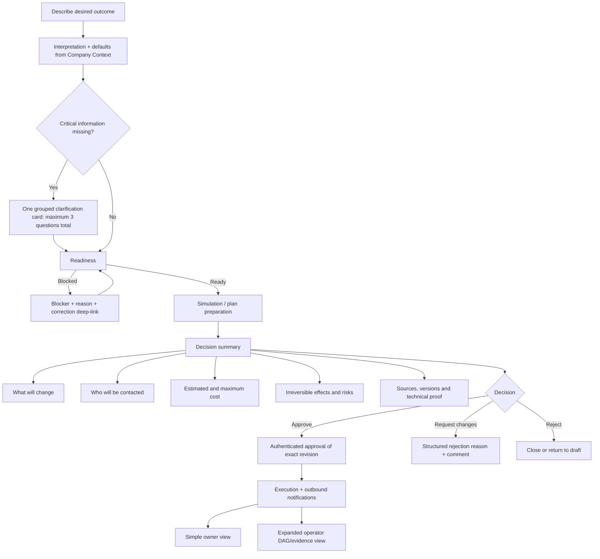

# YUX Autonomous Mission Supervisor — Design Specification

**Status:** Revised architecture and phased implementation baseline  
**Date:** 2026-08-22  
**Scope:** Agent Harness, Company Intelligence, Strategy Packs, Action Engine, CRM, e-mail automations, campaigns and cross-module missions.

## 1. Product outcome

Build a Mission Supervisor that accepts a business objective in natural language, retrieves the organization's approved knowledge and live operating state, proposes a versioned plan, and executes authorized system capabilities through the Action Engine. The completed product must manage any functional area only after that area's operations have been exposed as versioned capabilities; it must never receive arbitrary SQL, browser-control or unrestricted provider access.

The first complete vertical slice is **Funnel + Nurture**: from a request such as “create a CRM funnel and automate a sequence of e-mails,” the system must inspect the current workspace, retrieve the company's offer, ICP, brand and compliance context, create versioned drafts, simulate them, request approval, publish them, observe results and replan when necessary. The second vertical slice is **Campaign Launch**. The final product composes these and future packs under one Mission.

## 2. Non-negotiable architecture

```text
User objective
  -> Mission Intake and Clarification
  -> Mission Supervisor in Agent Harness
       -> Company Intelligence retrieval
       -> YUX Strategy Pack retrieval
       -> live-state baseline tools
       -> specialist subagents
  -> untrusted structured plan proposal
  -> Action Engine compiler and policy boundary
       -> permissions / entitlement / ownership / budget / approval
       -> durable action runs and idempotent attempts
  -> domain command capabilities
       -> CRM / Automations / E-mail / Campaigns / Landing Pages / Providers
  -> domain events, evidence and cost ledger
  -> observer / evaluator / replan
```

### 2.1 Ownership of responsibilities

- The **Agent Harness** interprets intent, retrieves context, asks clarification questions, selects packs and specialists, and proposes plans or replans.
- The **Action Engine** owns Mission intent, plan validity, authorization, approval state, execution state, retry, pause, cancellation, ownership, economics and audit.
- A **domain module** owns its invariants and data. Capabilities call domain commands instead of writing domain tables directly.
- **Automations** bound to a Mission are subprocesses. They cannot decide to continue, pause, cancel or replan the Mission.
- **Providers** are accessed only by TypeScript domain adapters after final Action Engine preflight. Provider credentials never enter the Harness prompt or output.

## 3. Existing foundation and explicit gaps

### 3.1 Reused components

- `backend/src/modules/action-engine/*`: Mission, plan, action, approval, observation, ownership and economics ledgers.
- `workers/marketing-studio-agent-runtime/yux_agent_runtime/*`: authenticated Harness, workflow engine, model routing, tool policy, traces and customer context retrieval.
- `backend/src/modules/company-intelligence/*`: organization profile, brand, curated knowledge and publication governance.
- `backend/src/modules/crm/*`: pipelines, stages, leads, tasks, scoring and sequence enrollment.
- `backend/src/modules/automations/*`: flows, triggers, conditions, actions, simulations, versions and sequences.
- `backend/src/modules/emailTemplates/*`: governed template drafts and publication.
- `backend/src/modules/campaigns/*`, `backend/src/modules/landing-pages/*` and provider adapters: campaign and acquisition surfaces.

### 3.2 Gaps that must be removed

- Mission planning currently sends empty `baseline` and `strategy_context` objects to the Harness.
- `mission.py` falls back to a deterministic Revenue Recovery plan and does not run a general Mission Supervisor model.
- `CapabilityContext.dryRun` is always `false`; `shadow` and `prepare` are not enforceable autonomy modes.
- The capability registry covers only a small Revenue Recovery subset.
- Campaigns lack a dedicated command repository suitable for Action Engine calls.
- Mission intake, metrics and UI are hard-coded to Revenue Recovery.
- Human-task completion records a fixed 30 minutes in the frontend.
- Evaluations are tied to signed revenue instead of the active pack's metric contract.
- Knowledge sources and live-state snapshots used by a plan are not frozen and linked to that plan.

## 4. Core domain contracts

### 4.1 General Mission request

```ts
type MissionGoal = {
  statement: string
  requestedOutcome: string
  scopeHints: string[]
  constraints: Record<string, unknown>
  acceptanceCriteria: Array<{ key: string; operator: string; target: string; unit: string }>
}

type AutonomyEnvelope = {
  mode: 'shadow' | 'prepare' | 'assisted' | 'autonomous'
  allowedModules: string[]
  allowedCapabilityKeys: string[]
  maxTotalCostBrl: string
  maxHumanHours: string
  maxExternalContacts?: number
  expiresAt: string
  alwaysRequireApprovalFor: Array<'external_effect' | 'publish' | 'budget_change' | 'delete' | 'legal_commitment'>
}
```

The current `title`, `objective`, `parameters`, `budget` and `deadlineAt` fields remain compatible. `goal` and `autonomyEnvelope` are additive JSONB snapshots so old Revenue Recovery missions continue to load.

### 4.2 Capability contract v2

`CapabilityDefinitionV2` is not duplicated manually between Python and TypeScript. Pydantic is the source of truth for Mission Supervisor wire contracts; its deterministic JSON Schema artifact is committed and consumed by the TypeScript compiler through generated types plus runtime JSON Schema validation. CI regenerates the artifact and fails on any diff. Domain capability input/output schemas remain owned by TypeScript because only the Action Engine executes them.

```ts
type CapabilityDefinitionV2<TInput, TOutput> = {
  key: string
  version: number
  domain: string
  effect: 'none' | 'draft' | 'internal' | 'external' | 'destructive'
  approval: 'never' | 'risk_based' | 'always'
  requiredModules: string[]
  requiredPermissions: string[]
  requiredConnections: string[]
  supportsModes: Array<'shadow' | 'prepare' | 'assisted' | 'autonomous'>
  recovery:
    | { kind: 'compensatable'; compensate: (context: CapabilityContext, result: TOutput) => Promise<CapabilityResult> }
    | { kind: 'pausable'; contain: (context: CapabilityContext, result: TOutput) => Promise<CapabilityResult> }
    | { kind: 'irreversible'; incidentType: string }
  inputSchema: ZodType<TInput>
  outputSchema: ZodType<TOutput>
  readiness(context: CapabilityReadinessContext, input: TInput): Promise<CapabilityReadiness>
  execute(context: CapabilityContext, input: TInput): Promise<CapabilityResult<TOutput>>
}
```

Every mutation capability must call a domain command with an idempotency key, return created or changed entity IDs, emit domain events, and supply cost/evidence references. No capability may directly bypass an existing domain permission or validation rule.

Recovery semantics are explicit rather than aspirational:

- **Compensatable:** drafts and mutable internal configuration have a tested inverse operation.
- **Pausable:** campaigns and sequences have a tested containment operation; containment does not claim to undo already accepted effects.
- **Irreversible:** sent messages, consumed media spend and accepted legal/external commitments create an incident-ledger entry when their outcome is unsafe or uncertain. The product never presents these as undone.

### 4.3 External-effect state machine

Before calling a provider, the Action Engine transactionally reserves a stable provider idempotency key and persists an effect intent. An attempt uses this state machine:

```text
reserved -> dispatched -> confirmed_created | confirmed_failed
                      \-> unknown -> reconciling -> confirmed_created | confirmed_failed | manual_review
```

A timeout or connection loss after dispatch is `unknown`, never `failed`. While an effect is unknown, dependent or duplicate effects remain blocked. A durable reconciliation job queries the provider by idempotency key, request metadata or provider reference and records evidence for the resolution. Providers without a safe lookup strategy cannot be enabled for autonomous external effects.

### 4.4 Context snapshot

Each planning and replan operation creates an immutable snapshot:

```ts
type MissionContextSnapshot = {
  missionId: string
  planRevision?: number
  organizationId: string
  query: string
  companyContext: Record<string, unknown>
  strategyItems: Array<{ id: string; version: number; contentHash: string }>
  knowledgeItems: Array<{ id: string; sourceId: string; contentHash: string; visibility: string }>
  liveState: Record<string, unknown>
  capabilityCatalogHash: string
  capabilityManifest: Array<{ key: string; version: number; definitionHash: string }>
  createdAt: string
}
```

Only published and profile-allowed organization knowledge may enter the snapshot. External actions additionally require externally-visible sources. Retrieved content is untrusted data and cannot grant tools, permissions or override system rules.

### 4.5 Plan proposal

The Harness returns an untrusted, JSON-only proposal containing:

- selected pack keys and versions;
- resolved parameters and assumptions;
- missing information or clarification questions;
- typed plan steps and dependencies;
- output bindings between steps;
- estimated economics;
- source IDs used for each decision;
- risks and requested approvals.

The TypeScript compiler rejects unknown packs, unknown capabilities, cycles, invalid bindings, unsupported autonomy modes, excess budgets, missing approvals, missing protected nodes and source IDs outside the frozen context snapshot. Every compiled step pins an exact capability version and definition hash from the approved catalog manifest; `latest` is forbidden. If a pinned definition is absent or its hash changes before execution, the Action Engine blocks the step as `capability_catalog_drift` and requires a newly compiled and approved plan.

### 4.6 Entity claims and leases

Mission ownership is enforced before planning readiness and again before mutation. Claims use the tuple `(organization_id, resource_type, resource_key, scope)` with `shared|exclusive` mode, a renewable TTL and a monotonically increasing fencing token. Examples include a whole pipeline, a pipeline's stage namespace, a campaign budget and a sequence enrollment population. Acquisition is transactional; a conflicting Mission receives an actionable readiness blocker naming the resource, current owner and lease expiry. Expired workers cannot mutate with an old fencing token.

## 5. Knowledge and Harness behavior

### 5.1 Context layers

The Mission Supervisor uses four isolated layers:

1. **Company context:** profile, products, ICP, brand voice, forbidden topics, compliance and published organization knowledge.
2. **YUX operating doctrine:** published Strategy Packs, playbooks, rubrics and prompt rules.
3. **Live workspace state:** current pipelines, sequences, campaigns, integrations, limits and recent metrics, obtained through read-only baseline adapters.
4. **Operational memory:** approved outcomes, interventions, failures and evaluation summaries from earlier Missions in the same organization.

Context retrieval runs first for intake, again for planning, and selectively before generation-heavy steps. Each run is tenant-filtered and traced. A replan receives observations plus the previous plan and context diff.

### 5.2 Supervisor and specialists

The supervisor may invoke bounded specialist profiles:

- `growth_strategist`
- `crm_architect`
- `automation_architect`
- `campaign_strategist`
- `copywriter`
- `brand_compliance_guardian`
- `measurement_analyst`

Specialists return typed artifacts only. They do not call mutation capabilities. The supervisor merges their artifacts into one proposal, while a verifier checks evidence, pack conformity, capability availability and economics before returning JSON.

Each planning or replan cycle has a `PlanningCycleBudget` covering maximum model calls, tokens, latency and BRL cost. A pack may declare deterministic specialist skips when its parameters and cached typed artifacts already satisfy a specialist's output contract. Artifact cache keys include organization, context hash, pack/version, specialist profile/version and relevant inputs; permission, policy or source-hash changes invalidate the entry. Exceeding the cycle budget returns a bounded clarification or human-review outcome rather than silently continuing model calls.

### 5.3 Active learning

Mission outcomes create learning recommendations, not production changes:

```text
observation -> evaluation -> learning recommendation -> shadow experiment
-> admin review -> versioned Strategy Pack / prompt / capability policy -> rollout
```

No model output may publish a prompt, knowledge document, pack, policy or provider configuration.

## 6. Autonomy semantics

| Mode | Reads | Creates drafts | Internal activation | External effect | Continuous optimization |
|---|---:|---:|---:|---:|---:|
| `shadow` | yes | no | no | no | simulation only |
| `prepare` | yes | yes | no | no | proposals only |
| `assisted` | yes | yes | after approval | after approval | after approval |
| `autonomous` | yes | yes | within envelope | only when envelope and policy allow | within approved guardrails |

Independent of mode, destructive actions, legal commitments, first-contact outreach, publication with new budget, credential changes and permission changes always require explicit approval in the first production release.

The executor derives `dryRun` and allowed effect classes from the Mission mode. It repeats the policy check immediately before each effect. Pause, cancel, expired authorization or a kill switch prevents new effects but preserves confirmed results and audit history.

For external mutations, successful final preflight issues a signed, single-attempt mutation lease containing Mission, action, attempt, capability definition hash, fencing token, effect class and an expiry of at most 30 seconds. The provider adapter validates it immediately before dispatch. Revocation cannot eliminate the interval after provider acceptance, so this residual window is explicitly documented and handled through the external-effect reconciliation state machine rather than described as zero-risk cancellation.

## 7. Action Packs

### 7.1 Packs shipped by the complete program

- `revenue_recovery@1.0.0`
- `crm_foundation@1.0.0`
- `funnel_nurture@1.0.0`
- `campaign_launch@1.0.0`
- `campaign_optimization@1.0.0`

Packs expose protected nodes and extension points. A composite Mission selects multiple published packs and creates cross-pack dependencies without copying or mutating their definitions. Free-form DAGs remain forbidden.

### 7.2 Funnel + Nurture protected outcome

The pack must inspect existing CRM state, propose a funnel, create a draft pipeline and stages, generate governed email templates, create a draft sequence, simulate entry/exit conditions, request approval, publish, observe conversion/reply/opt-out metrics and evaluate against explicit targets.

### 7.3 Campaign Launch protected outcome

The pack must compile a brief, preview an audience, create campaign and creative drafts, create or link a landing page and lead form, validate tracking, create a provider campaign paused, request budget/publication approval, activate, observe spend/leads/CPL/conversion/revenue and pause or replan on guardrail breach.

## 8. Authorization and safety

The effective permission for an action is the intersection of:

```text
authenticated actor permission
AND contract module entitlement
AND Mission autonomy envelope
AND Agent tool policy
AND capability policy
AND entity ownership
AND legal/consent policy
AND budget and provider health
```

The system must enforce tenant identity at API, Harness, repository and provider-command boundaries. Capability inputs and outputs are schema-validated; secrets and raw credentials are prohibited from prompts, traces and capability results. Domain commands are idempotent and emit correlation IDs containing Mission, plan, action and attempt identities.

Retrieved knowledge is delimited and labeled as untrusted evidence. Supervisor and specialist prompts prohibit treating retrieved instructions as authority. The security suite maintains an adversarial tenant-scoped corpus containing direct instruction overrides, fake system messages, encoded instructions, tool-escalation requests and cross-tenant exfiltration bait. Release 2 cannot generate production-reviewable copy until this suite proves that citations may influence business content but cannot change tool, policy, permission or output-schema behavior.

## 9. User experience

Mission creation becomes conversational but remains inspectable:

1. User describes the desired result.
2. Supervisor returns its interpretation, missing information and proposed scope.
3. User confirms constraints, autonomy, budget and deadline.
4. Readiness displays blockers and fixes.
5. Planner proposes packs, plan, artifacts, economics, sources and approvals.
6. User reviews a plain-language impact summary and approves the exact immutable plan revision; its hash is secondary integrity evidence, never the primary label.
7. Cockpit shows steps, artifacts, pending decisions, metrics, costs and evidence.
8. User may pause, resume, cancel, request evaluation or approve a replan.

Clients receive permissions configured by role rather than a hard-coded read-only check. Internal YUX operators retain cross-workspace assisted operation.

### 9.1 Decision wireflow



The decision summary uses concrete quantities, for example: “Create 1 funnel with 4 stages and 4 e-mails; enroll no existing contacts; estimated execution cost R$ 340; maximum authorized cost R$ 500.” The immutable hash and source manifest appear under “Technical proof.” A changed artifact, budget, audience, provider target, capability version or recovery class invalidates the approval and requires a new summary.

Clarification is capped at three questions for the entire intake, shown in one grouped card. The Supervisor fills safe defaults from Company Context and visibly labels them. If a safety-critical value remains unknown after the response, it returns a readiness blocker or human-review decision instead of another question loop.

Pending decisions are delivered through the user's configured in-product, e-mail or WhatsApp notification channel. Notification payloads contain no secrets or sensitive lead data and link to the authenticated decision screen. Escalation timing defaults to 4 and 24 hours and is configurable per organization.

The cockpit uses progressive disclosure:

- **Business owner:** current outcome, progress, “what you need to decide,” spend and next checkpoint.
- **Operator:** complete DAG, bindings, attempts, evidence, versions, leases, provider reconciliation and economics.

### 9.2 Decision accelerators

- A `shadow` run can create a redacted simulation report with a signed link and PDF, expiring after 7 days by default. External reviewers can record an opinion and structured feedback, but execution authorization still requires an authenticated actor with contract permission.
- Approval rejection reasons use a versioned taxonomy: `wrong_goal`, `wrong_icp`, `wrong_tone`, `wrong_offer`, `cost_too_high`, `risk_too_high`, `timing_wrong`, `missing_evidence`, `artifact_error`, `other`. `other` requires a comment.
- Budget burn-down emits deduplicated alerts when actual plus reserved cost first crosses 50%, 80% and 95% of the envelope; the hard ceiling remains authoritative.
- Readiness blockers include a permission-checked correction route such as the exact integration, knowledge or contract screen.
- Kill switches exist globally, per organization, per pack and per exact capability key/version. Disabling `email.send@1` need not cancel unrelated draft or CRM work.

## 10. Observability and economics

Every LLM call, capability attempt, provider request, approval, domain event and cost entry is correlated. Operations health must expose queue lag, planner failures, action failures, expired approvals, ownership conflicts, kill switches, knowledge retrieval failures, model/provider cost and unreconciled effects without exposing PII.

Metrics are defined by each pack. Unknown values remain unknown. Economics include AI, provider, media, human and external-service costs, as well as net value, value/cost, value per human hour and human-free execution rate.

Every pack that reports produced value publishes an immutable `AttributionPolicy` with model (`first_touch`, `last_touch` or `linear`), attribution window, eligible event types, identity-resolution rules, currency treatment and late-event behavior. Evaluation stores the policy version/hash beside each value metric and the cockpit displays it next to value/cost. A pack without an approved attribution policy may report operational outcomes, but its produced value remains `unknown` and cannot be used to claim ROI.

### 10.1 Non-functional requirements

| Area | Release target |
|---|---|
| Intake interpretation | p95 ≤ 10 seconds and p99 ≤ 20 seconds, measured server-side excluding client network |
| Single-pack planning | p95 ≤ 45 seconds and p99 ≤ 90 seconds |
| Composite planning | p95 ≤ 90 seconds and p99 ≤ 180 seconds |
| UX responsiveness | progress state within 1 second; planning is asynchronous and resumable |
| Ready-action scheduling | p95 ≤ 5 seconds from durable readiness to worker claim under normal capacity |
| Local final preflight | p95 ≤ 250 ms excluding provider latency |
| Action Engine availability | 99.9% monthly for intake/state/approval/execution APIs |
| Harness planning availability | 99.5% monthly; outage must not stop already compiled deterministic execution |
| Durability | no acknowledged plan, approval, effect intent, cost or incident may be lost after process/Redis restart |

The defaults for production retention are:

- plan/context manifests, approvals, effect intents, incidents and economics: 24 months;
- redacted Supervisor/specialist traces and model-usage records: 90 days;
- encrypted provider request/response bodies required for reconciliation: 30 days, then reduce to references, hashes and outcome evidence;
- application logs: 30 days; aggregated non-PII SLO metrics: 13 months;
- legal hold and organization deletion override expiration through explicit audited policy.

Prompt and trace persistence uses allowlisted structured fields. Secrets, authorization headers, cookies and provider tokens are dropped, never masked. E-mail, phone, CPF, street address and free-text lead content are replaced with stable per-Mission tokens before observability export; raw values remain only in the owning domain store. Company knowledge needed for a generated artifact may enter the live model request, but traces store source ID, content hash and redacted excerpt rather than the full body. Redaction failures fail closed for telemetry export and emit a security event.

### 10.2 Model and regression policy

Runtime configuration references a versioned `ModelProfile` containing provider, exact model identifier, parameters, fallback order, prompt bundle hash, maximum tokens, timeout and cost ceiling. Production never targets an unversioned alias without capturing the provider-resolved model identifier in the trace.

The repository maintains at least 15 frozen golden missions spanning Revenue Recovery, CRM/funnel, nurture, campaign, composite, missing context, malicious knowledge, tenant isolation, budget pressure and provider uncertainty. Any model, prompt, pack, retrieval or planner change runs the corpus. Promotion requires 100% schema validity, safety-policy and tenant-isolation cases; 100% protected-node preservation; at least 90% domain-rubric score; and no more than 20% regression in median cost or p95 latency unless an admin records an explicit benchmark exception. Golden runs use sanitized fixtures and never call production mutation providers.

## 11. Delivery phases

0. **Safety foundation:** generated cross-runtime contracts, recovery classes, external-effect reconciliation, catalog pinning, claims/leases, planning-cycle budgets, attribution contracts, short-lived mutation leases, NFR instrumentation and golden missions.
1A. **General foundation and knowledge:** generic goal, frozen context, real Harness supervisor, autonomy semantics and conversational intake. This is engineering validation, not autonomous customer value.
1B. **Decision experience:** human-readable approval, progressive cockpit, notifications, shareable shadow report, deep-linked readiness and budget controls.
2. **Funnel + Nurture vertical slice:** CRM, templates, sequences, simulation, approval, publication and evaluation, gated by adversarial knowledge tests.
3. **Campaign Launch vertical slice:** campaign command layer, acquisition artifacts, provider-paused creation, approval, reconciliation and monitoring.
4. **Composite supervisor:** multi-pack planning, specialist orchestration, cross-pack bindings and generalized evaluation.
5. **Bounded autonomy and learning:** autonomous envelope, continuous checkpoints, recommendations, shadow experiments, production rollout and incident controls.

Each phase must be deployable behind capability and contract flags, preserve existing Revenue Recovery missions, and pass unit, integration, contract, worker, tenant-isolation and browser acceptance tests.

Every release ships its own rollback runbook. Mandatory rollback triggers are: cross-tenant exposure or secret leakage (immediate global stop); duplicate or unauthorized external effect (disable exact capability and pause affected Missions); unreconciled `unknown` effects older than the provider-specific SLO; SLO breach for two consecutive 15-minute windows after rollout; golden safety regression; or migration/data-integrity failure. A rollback preserves append-only audit/effect/cost records, disables new work, contains pausable providers, reconciles unknown effects and only then releases claims.

After the first domain packs stabilize, versioned Mission Recipes may preselect compatible packs, defaults and copy for a sector without bypassing pack compilation. A tenant-scoped sandbox seeder may create clearly labeled disposable CRM/campaign fixtures so a new organization can run a meaningful shadow Mission on day one; seeded entities are isolated from production metrics and removable through their recorded seed manifest.

## 12. Complete-program acceptance criteria

- A user can request a funnel plus email nurture in natural language and receive a grounded, versioned plan.
- The plan cites published organization knowledge and Strategy Pack versions and freezes their hashes.
- In `shadow`, the same Mission produces no database or provider mutation.
- In `prepare`, the Mission creates drafts but cannot publish or activate them.
- In `assisted`, exact artifacts and external effects require approval.
- In `autonomous`, only effects inside a time-bound envelope execute without per-action approval.
- A campaign Mission can create all local artifacts, create the provider campaign paused, obtain publication approval, activate and monitor it.
- A composite Mission can depend on an approved Funnel + Nurture output before launching a Campaign Pack.
- Pause/cancel/kill switch prevents new effects at final preflight.
- Duplicate jobs and callbacks create one domain effect and one cost entry.
- Tenant A knowledge, tools, artifacts and traces never appear in Tenant B.
- Every plan and action is explainable by goal, context snapshot, source IDs, pack version, capability version, approvals, evidence and economics.
- Learning recommendations cannot change production without versioned admin approval.
- Regenerating Python-owned Mission wire schemas produces no uncommitted diff, and TypeScript validates the exact committed artifact.
- An external timeout becomes `unknown` and blocks dependent effects until reconciliation resolves it.
- Execution never substitutes `latest` for a pinned pack or capability version/hash.
- Two Missions with conflicting resource claims are blocked during readiness, and an expired fencing token cannot mutate.
- Every planning cycle stays inside its model-call, token, latency and BRL budget or exits for clarification/review.
- ROI is shown only with the exact pack attribution-policy version/hash visible beside it.
- Adversarial knowledge cannot alter tools, permissions, policy or the required response schema.
- A provider dispatch requires a valid mutation lease; incident documentation states the residual post-dispatch kill-switch window.
- Decision screens state concrete changes, contacts, estimated/maximum cost and irreversible effects before showing the plan hash.
- Intake asks no more than three grouped clarification questions and never loops indefinitely.
- Decision notifications reach the configured channel without exposing lead PII.
- Business-owner and operator views expose different detail levels over the same immutable Mission state.
- Each release meets its latency, availability, durability, retention, redaction and objective rollback gates.
- A model, prompt, retrieval or pack change cannot be promoted until the golden-mission thresholds pass.

## 13. Review disposition and implementation traceability

| Review concern | Adopted decision | Primary release/task |
|---|---|---|
| Python↔TypeScript schema drift | Pydantic export → committed JSON Schema → generated TypeScript + Ajv; CI diff gate | Release 0, Task 1 |
| Generic compensation promise | Discriminated compensatable/pausable/irreversible recovery contract | Release 0, Task 2 |
| Provider result unknown after timeout | Pre-dispatch effect intent, `unknown` state and durable reconciliation | Release 0, Task 3 |
| Catalog drift after approval | Exact pack/capability version and definition hash; drift requires approved replan | Release 0, Task 4 |
| Concurrent Missions | Resource claims with TTL and fencing tokens surfaced in readiness | Release 0, Task 5 |
| Specialist cost/latency explosion | Planning-cycle ceilings, deterministic specialist skip and typed artifact cache | Release 0, Task 6 |
| Revenue attribution honesty | Immutable pack attribution policy and unknown ROI without sufficient evidence | Release 0, Task 7; pack tasks in Releases 2–3 |
| Prompt injection through knowledge | Untrusted evidence delimiters plus adversarial golden/copy corpus | Release 0, Task 10; Release 2, Task 4 |
| Residual kill-switch window | 30-second maximum single-attempt mutation lease plus explicit reconciliation runbook | Release 0, Task 8 |
| Missing NFRs/retention/redaction | Numeric latency/SLO targets, 30/90-day data reductions, 24-month audit retention and fail-closed telemetry | Release 0, Task 9 |
| Rollback too implicit | Objective triggers and rehearsed runbook in every release | Final task of every release plan |
| Approval comprehension | Deterministic natural-language impact summary; hashes under Technical Proof | Release 1B, Tasks 1 and 3 |
| Infinite clarification | One grouped card, three questions total, then blocker/review | Release 1B, Task 2 |
| Cockpit surveillance | Durable in-product/e-mail/consented-WhatsApp decision delivery | Release 1B, Task 4 |
| One cockpit for two personas | Owner-first view with progressive operator evidence | Release 1B, Task 3 |
| Shadow has little visible value | Expiring redacted link/PDF with non-authoritative stakeholder review | Release 1B, Task 5 |
| Unstructured rejection feedback | Versioned decision-reason taxonomy tied to exact subject | Release 1B, Task 6 |
| Budget/readiness operations | 50/80/95 burn-down alerts, safe correction deep-links and granular kill switch | Release 1B, Task 7 |
| Blank-page adoption | Versioned sector Recipes compiled through normal pack controls | Release 2, Task 8 |
| No meaningful day-one tenant data | Disposable manifest-owned sandbox fixtures excluded from production metrics | Release 2, Task 8 |
| Model/prompt upgrade regression | At least 15 frozen golden Missions and quantitative promotion thresholds | Release 0, Task 10 |
