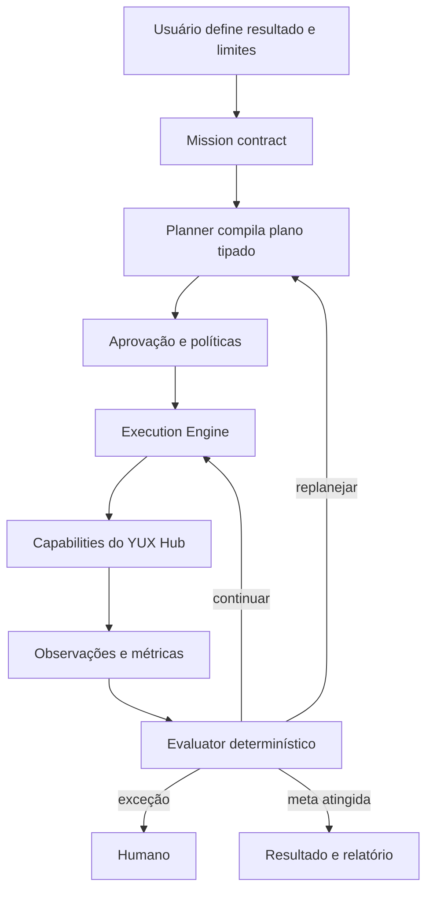
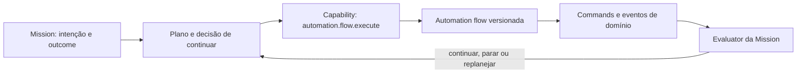

# YUX Action Engine — Visão de Produto e Arquitetura

**Status:** direção estratégica aprovada e materializada no MVP local; rollout pendente  
**Data:** 2026-08-14  
**Revisão:** 2026-08-21 — Action Pack v0, ownership de automações e economia por missão  
**Escopo:** aprofundamento conceitual anterior à implementação  
**Documentos relacionados:**

- `docs/superpowers/specs/2026-08-14-yux-action-engine-mvp-design.md`
- `docs/superpowers/plans/2026-08-14-yux-action-engine-mvp.md`
- `docs/yux-strategy-engine.md`
- `docs/yux-agent-harness-runtime.md`
- `docs/superpowers/plans/2026-08-03-orquestracao-integrada-de-leads.md`

## 1. Leitura executiva

A resposta analisada propõe uma mudança correta e potencialmente fundadora para a YUX: o Hub atual não deve ser substituído por uma interface conversacional nem refeito como “um agente”. Ele deve continuar sendo o plano de controle da operação, enquanto uma nova camada passa a coordenar suas capacidades a partir de resultados empresariais.

A mudança pode ser resumida assim:

```text
Hoje
usuário escolhe módulo -> configura função -> executa -> interpreta o resultado

Direção proposta
usuário define resultado -> YUX planeja -> solicita as aprovações necessárias
-> executa capacidades -> observa métricas -> avalia -> replana
```

Isso não é apenas uma nova home. É uma mudança da unidade central do produto:

- de campanha, lead, automação ou projeto;
- para uma **missão mensurável**, que coordena campanhas, leads, automações, tarefas, agentes e pessoas.

O repositório confirma que uma parte relevante do substrato já existe: plataforma modular, workspaces, contratos e módulos, CRM, campanhas, automações, outbox transacional, ledger por consumidor, filas, Strategy Engine, Agent Harness, RAG, policies, traces e outcomes. Contudo, essas peças ainda não formam um Action Engine. Faltam contratos explícitos de capability, missão como entidade de negócio, plano executável versionado, execução persistente orientada por missão e avaliação fechando o ciclo.

A recomendação é adotar essa direção agora, mas construir por níveis. O primeiro produto deve ser um **Action Engine assistido e auditável**, não um sistema de autonomia irrestrita. Ele já deve nascer apoiado em um `Revenue Recovery Pack v0`, com hierarquia explícita sobre automações subordinadas e contabilidade completa do custo de execução. Assim, o primeiro piloto valida simultaneamente outcome, repetibilidade e productização.

## 2. O que a resposta realmente está dizendo

Há cinco teses dentro da resposta original.

### 2.1 O software já construído é infraestrutura, não legado descartável

CRM, campanhas, automações, WhatsApp, relatórios e projetos continuam necessários. Eles armazenam estado, oferecem controle manual, integram provedores e permitem auditoria. O Action Engine depende deles para executar trabalho real.

Portanto, não há uma migração de “Hub tradicional” para “produto de IA”. Há uma composição:

```text
Action Engine = coordenação orientada a resultado
YUX Hub       = controle, inspeção e intervenção
Módulos       = capacidades operacionais
Infraestrutura = persistência, filas, eventos e integrações
```

### 2.2 O diferencial não é conversar; é assumir responsabilidade operacional

Um chat que recomenda ações ainda é um consultor digital. Um Action Engine transforma uma intenção em trabalho rastreável, produz artefatos, solicita decisões humanas, executa o que foi autorizado e mede o resultado.

A promessa não deve ser “pergunte qualquer coisa à YUX”. A promessa defensável é:

> Defina um resultado, seus limites e o prazo. A YUX organiza e executa o trabalho necessário, mostra o que está acontecendo e adapta o plano com você.

### 2.3 Módulos precisam se tornar capabilities

Uma tela não é uma capability. Uma rota HTTP também não é uma capability. Capability é um contrato de domínio estável que um humano, uma automação ou o Action Engine consegue invocar com o mesmo significado.

Exemplo:

```text
Tela: “Mover lead”
Rota: PATCH /leads/:id
Capability: crm.lead.move_stage
```

A capability declara entradas, saídas, efeitos, permissões, risco, custo, idempotência, observabilidade e política de aprovação. Ela esconde do planner detalhes de banco, provedor ou interface.

### 2.4 O loop de avaliação é o verdadeiro salto

Um workflow executa uma sequência. Um Action Engine opera um ciclo:

```text
PLAN -> ACT -> OBSERVE -> EVALUATE -> DECIDE -> REPLAN
```

Sem observação e avaliação, existe apenas automação gerada por IA. Sem limites e aprovação, existe automação insegura. Sem versionamento, existe uma operação impossível de auditar.

### 2.5 O modelo também productiza o serviço humano

Pessoas não desaparecem do desenho. Diagnóstico, revisão de mensagem, negociação, produção especial, decisão legal e fechamento podem ser ações humanas do plano. Isso permite medir onde a equipe participa, reduzir trabalho repetitivo e transformar playbooks de serviço em produto progressivamente.

### 2.6 Onde a resposta original precisa ser qualificada

A direção está correta, mas a afirmação de que “falta principalmente a primeira camada” é otimista. As camadas inferiores existem em maturidades diferentes e ainda precisam ser normalizadas para servir a um orquestrador geral.

- Algumas capabilities são commands confiáveis; outras ainda são telas, services ou bases provider-neutral.
- O outbox e o ledger resolvem entrega confiável de eventos, mas não resolvem a state machine de missão, budget, approval ou compensação.
- O Agent Harness já planeja workflows estratégicos, mas ainda não produz o contrato de plano transversal definido neste documento.
- Outcomes e learning signals existentes ajudam na rastreabilidade, mas não substituem métricas canônicas, baseline e atribuição de missão.
- “MVP não muito complexo” é verdadeiro apenas para `Goal -> Plan -> Approval -> Execute -> Report`, com escopo estreito e forte supervisão. O loop adaptativo contínuo é outro patamar de produto e operação.
- A dificuldade dominante migra da geração de texto para contratos de domínio, qualidade de dados, segurança de efeitos, atribuição e operação de exceções.

Portanto, o ativo pré-existente reduz muito o custo de começar, mas não elimina o trabalho de produto e engenharia necessário para tornar as peças composáveis e confiáveis.

## 3. Definições canônicas

### Outcome

Resultado de negócio que pode ser observado, como receita contratada, agendamentos realizados, oportunidades reativadas ou redução de CPL.

### Goal

Intenção declarada pelo usuário. Pode começar vaga e ainda não ser executável: “quero vender mais”.

### Mission

Contrato operacional aceito pelo sistema. Contém baseline, meta, prazo, orçamento, métricas, restrições, escopo, responsáveis, nível de autonomia e regras de atribuição. Uma missão deve ser mensurável e possuir critério explícito de término.

### Plan

Versão imutável de uma estratégia operacional. É um grafo de passos tipados com dependências, condições, capabilities, ações humanas, checkpoints, critérios de sucesso e orçamento reservado.

### Capability

Operação ou observação de domínio disponível ao engine. Pode apenas ler, preparar um artefato, produzir um efeito reversível, produzir um efeito externo ou criar uma tarefa humana.

### Action

Instância de um passo do plano para uma missão específica. Possui estado, entrada resolvida, tentativas, aprovação, resultado, custo e evidências.

### Observation

Fato coletado durante a missão: métrica, evento, estado de entidade, resposta de canal, intervenção humana ou disponibilidade de integração.

### Evaluation

Comparação determinística entre observações e critérios da missão/plano. Pode concluir que a missão está convergindo, fora do esperado, bloqueada, atingida ou inviável.

### Replan

Criação de uma nova versão do plano. Um replan nunca altera silenciosamente o plano que estava em execução.

### Action Pack

Playbook versionado por objetivo e setor. Define sinais, topology protegida, extension points, parâmetros, capabilities, métricas, modelo econômico, thresholds, guardrails, perguntas de qualificação e critérios de escalonamento humano.

## 4. Tese de produto

O YUX Action Engine deve ser a camada de execução empresarial da plataforma. O YUX Hub permanece como sua interface de controle.



Essa camada não deve duplicar domínio. O CRM continua sendo autoridade sobre leads e pipeline; Campanhas continua sendo autoridade sobre campanhas; Omnichannel continua sendo autoridade sobre conversas. A missão referencia e coordena esses registros.

## 5. Princípios arquiteturais

### 5.1 Postgres é a fonte de verdade da missão

Missões, planos, ações, aprovações, observações e avaliações são persistidos. A fila acelera trabalho, mas não é o estado do produto.

### 5.2 O LLM propõe; contratos e policies autorizam

O planner pode gerar uma proposta de plano. O backend valida:

- se cada capability existe e está disponível;
- se inputs correspondem ao schema;
- se dependências formam um grafo válido;
- se módulos e integrações estão ativos;
- se orçamento e limites são compatíveis;
- se aprovações foram inseridas;
- se não há ação proibida.

Somente um plano validado pode se tornar executável.

### 5.3 Métricas são computadas por código

O modelo pode explicar por que uma métrica mudou e sugerir hipóteses. Ele não decide sozinho se `R$ 9.850 >= R$ 10.000`, se o prazo venceu ou se o teto de orçamento foi violado.

### 5.4 Side effects ficam no backend TypeScript

O Agent Harness planeja, classifica, recupera contexto, verifica e sintetiza. Ele não envia mensagens nem altera provedores diretamente. O backend executa commands/capabilities idempotentes, coerente com a governança atual.

### 5.5 Todo efeito tem identidade e correlação

Cada invocação recebe chave de idempotência, `missionId`, `planId`, `actionId`, `correlationId` e, quando aplicável, `causationId`. Retry não pode repetir o efeito de negócio.

### 5.6 Planos são versionados

Uma revisão aprovada é congelada. Replanning gera `revision + 1`, registra o motivo, compara alterações e requer nova aprovação quando amplia risco, gasto ou escopo.

### 5.7 A camada outcome-first é aditiva

O usuário sempre pode abrir o CRM, a campanha, a conversa, a automação ou a tarefa associada. Não se deve esconder controles importantes dentro de um chat.

### 5.8 Humanos são executores de primeira classe

`human.create_task`, `human.request_decision` e `human.review_artifact` são capabilities. Espera humana, SLA e resolução fazem parte da execução.

### 5.9 O Action Engine é proprietário da intenção; automações são subprocessos

Quando uma automação participa de uma Mission, ela não é um segundo orquestrador autônomo. Ela é uma capability/subprocesso com versão congelada, escopo, input, timeout, budget e condição de término definidos pelo plano.



O Action Engine decide se a missão continua, pausa, encerra ou replana. A automação decide apenas como executar seu subprocesso dentro do contrato recebido. Ela não altera target, population, budget, estratégia ou estado final da missão.

Automações independentes continuam válidas fora de missões. Quando disputarem a mesma entidade ou efeito com uma missão ativa, um ownership resolver aplica a regra registrada: observar, compartilhar ações disjuntas, bloquear o novo fluxo ou dar precedência à missão. A correlação da própria missão sempre acompanha o subprocesso.

### 5.10 Economia da missão é estado de produto, não relatório posterior

Outcome sem custo não prova productização. Cada missão deve contabilizar desde o primeiro piloto:

- valor confirmado produzido;
- custo de IA;
- custo de providers/APIs;
- mídia e serviços externos, quando existirem;
- horas humanas e taxa de custo congelada;
- custo total de execução;
- valor líquido;
- razão valor/custo;
- valor por hora humana;
- proporção de ações concluídas sem intervenção humana.

Custos estimados orientam aprovação; custos reais entram em ledger imutável por ação/tarefa. Uma avaliação econômica acompanha cada checkpoint e o relatório final.

## 6. A Mission como contrato operacional

O objeto sugerido na resposta original é um bom início, mas insuficiente para uma operação confiável. Uma missão precisa responder:

- **o que** deve mudar;
- **de quanto para quanto**;
- **até quando**;
- **em qual população/escopo**;
- **com qual orçamento**;
- **sob quais restrições**;
- **quem responde por ela**;
- **qual evento conta como resultado**;
- **qual janela e modelo de atribuição** serão usados;
- **o que o sistema pode executar sem aprovação**.

Exemplo conceitual:

```json
{
  "title": "Recuperar receita de oportunidades paradas",
  "outcomeType": "recovered_revenue",
  "baseline": { "value": 0, "currency": "BRL", "asOf": "2026-08-14" },
  "target": { "operator": ">=", "value": 10000, "currency": "BRL" },
  "deadline": "2026-09-13T23:59:59-03:00",
  "scope": {
    "workspace": "Crescimento YUX",
    "population": "oportunidades abertas sem interação há 14 dias",
    "exclusions": ["opt-out", "proposta perdida por preço final", "contato sem base legal"]
  },
  "budget": {
    "currency": "BRL",
    "totalExecutionCostLimit": 1200,
    "apiAndProviderCostLimit": 300,
    "mediaSpendLimit": 0,
    "aiCreditLimit": 250,
    "humanHoursLimit": 12,
    "humanCostRate": 75
  },
  "successMetrics": [
    { "key": "signed_revenue", "target": 10000, "aggregation": "sum" }
  ],
  "guardrailMetrics": [
    { "key": "unsubscribe_rate", "operator": "<=", "threshold": 0.02 },
    { "key": "complaint_count", "operator": "=", "threshold": 0 }
  ],
  "attribution": {
    "model": "mission_touch_then_signed_contract",
    "windowDays": 30
  },
  "autonomyProfile": "assisted",
  "ownerId": "user-id"
}
```

O processo de criação deve qualificar objetivos vagos. Se não houver baseline, fonte de métrica ou critério de sucesso, a missão fica em `draft` e o sistema pede os dados faltantes. O engine não deve fingir precisão.

## 7. Planner: de intenção para plano compilável

O planner realiza quatro estágios separados.

### 7.1 Qualificação

Transforma o Goal em Mission contract. Identifica ambiguidade, dados ausentes, conflitos e impossibilidade de medição.

### 7.2 Diagnóstico

Usa capabilities somente de leitura para gerar um snapshot: pipeline, segmentos, consentimento, integrações, histórico, capacidade da equipe, métricas e restrições.

### 7.3 Síntese

Seleciona um Action Pack e produz uma instanciação adaptada ao contexto. No MVP, a missão de recuperação parte obrigatoriamente do `Revenue Recovery Pack v0`; o planner escolhe parâmetros, ramos opcionais e conteúdo dentro dos extension points permitidos. Ele não inventa um DAG inteiramente novo. Texto livre pode acompanhar a proposta, mas o plano executável é JSON validado e comparável ao template do pack.

### 7.4 Compilação e validação

O backend resolve versões de capabilities, valida parâmetros, insere checkpoints de aprovação, calcula custos máximos, impede ciclos inválidos e congela a revisão.

Um plano precisa suportar:

- sequência e paralelismo;
- dependências condicionais;
- ações de leitura, escrita e humanas;
- espera por evento ou prazo;
- retry e timeout;
- critérios de conclusão por passo;
- caminhos de falha;
- compensação quando disponível;
- checkpoints de avaliação;
- orçamento estimado e máximo.

## 8. Capability Registry

### 8.1 O registro é contrato, não catálogo de endpoints

Na primeira versão, definições executáveis devem morar em código versionado. O banco pode armazenar disponibilidade e overrides por organização, mas não deve receber código dinâmico.

Contrato conceitual:

```ts
type CapabilityDefinition<TInput, TOutput> = {
  key: string
  version: number
  kind: 'query' | 'prepare' | 'command' | 'wait' | 'human'
  moduleKey: string
  inputSchema: Schema<TInput>
  outputSchema: Schema<TOutput>
  requiredPermissions: string[]
  requiredConnections: string[]
  risk: 'low' | 'medium' | 'high' | 'critical'
  approval: 'never' | 'policy' | 'always'
  idempotency: 'required' | 'not_applicable'
  reversibility: 'reversible' | 'compensatable' | 'irreversible'
  costModel: CostModel
  execute(context: CapabilityContext, input: TInput): Promise<TOutput>
}
```

### 8.2 Categorias iniciais

**Observe**

- `crm.pipeline.snapshot`
- `crm.leads.search`
- `crm.lead.timeline.read`
- `reports.mission_metrics.snapshot`
- `integrations.availability.check`

**Prepare**

- `growth.segment.preview`
- `marketing.content.draft`
- `omnichannel.message.draft`
- `proposal.draft`

**Act**

- `crm.lead.assign_owner`
- `crm.lead.move_stage`
- `crm.task.create`
- `crm.sequence.enroll`
- `email.message.queue`
- `whatsapp.template.queue`
- `campaign.pause`

**Human**

- `human.task.create`
- `human.approval.request`
- `human.review.request`

O MVP não precisa implementar todos. O registro deve começar apenas com operações já confiáveis no backend.

### 8.3 O que cada capability deve declarar

- descrição semântica e casos de uso;
- schema de entrada e saída;
- versão;
- tipo de efeito;
- owner de domínio;
- módulo e entitlement necessários;
- permissões;
- integrações e health checks;
- custo fixo/estimado;
- nível de risco;
- regra padrão de aprovação;
- suporte a dry-run;
- política de idempotência;
- timeout e retry;
- eventos emitidos;
- evidência de sucesso;
- compensação/reversão;
- política de exposição de PII.

## 9. Execution Engine

O executor é uma máquina de estados persistente, não um loop em memória.

### 9.1 Estados da missão

```text
draft -> planning -> pending_approval -> ready -> active
active -> paused | blocked | evaluating | succeeded | failed | expired | cancelled
evaluating -> active | pending_replan_approval | succeeded | failed
pending_replan_approval -> active | cancelled
```

### 9.2 Estados de ação

```text
pending -> ready -> waiting_approval -> queued -> running
running -> succeeded | failed | retry_scheduled | blocked
pending/ready/waiting_approval -> skipped | cancelled
```

### 9.3 Regras fundamentais

- apenas passos cujas dependências foram satisfeitas ficam `ready`;
- uma ação nunca executa se o plano não for a revisão ativa aprovada;
- a policy é reavaliada imediatamente antes do efeito;
- o resultado é validado contra o output schema;
- o step só conclui após a evidência de sucesso definida;
- falha técnica e falha de negócio são diferentes;
- cada tentativa é registrada separadamente;
- timeout pode gerar retry, bloqueio ou escalonamento conforme capability;
- cancelamento impede novos jobs e preserva histórico;
- efeitos irreversíveis não são “desfeitos” por mudança de estado no banco.

## 10. Evaluator e atribuição

O evaluator precisa separar três perguntas.

### 10.1 A execução funcionou?

Exemplo: a mensagem foi enfileirada e entregue? A tarefa foi criada? A campanha foi pausada?

### 10.2 A estratégia está produzindo sinais intermediários?

Exemplo: contatos responderam, reuniões foram marcadas, propostas foram visualizadas?

### 10.3 A missão atingiu o outcome?

Exemplo: contratos assinados atribuídos à missão somam R$ 10 mil?

Cada métrica deve ter:

- fonte de dados;
- fórmula;
- unidade;
- granularidade;
- frequência de coleta;
- baseline;
- target ou guardrail;
- janela temporal;
- modelo de atribuição;
- tratamento de dados atrasados;
- owner de qualidade.

O LLM pode produzir diagnóstico e hipóteses após a avaliação determinística. Uma recomendação de replan deve citar observações e registrar confiança. O evaluator nunca deve inventar uma métrica ausente.

## 11. Replanning

Replanning pode ocorrer quando:

- uma métrica cruza threshold negativo;
- o progresso fica abaixo da trajetória esperada;
- uma integração deixa de estar disponível;
- orçamento ou prazo fica insuficiente;
- uma ação humana não cumpre SLA;
- uma hipótese do plano é falsificada;
- o usuário muda escopo, prazo ou limites.

O sistema gera uma revisão comparável:

```text
Plano v1
- sequência A
- 120 contatos
- teto de R$ 300

Plano v2 proposto
- pausa sequência A
- mantém 44 contatos ainda ativos
- cria variante B para o segmento de maior fit
- teto adicional de R$ 120
Motivo: resposta de A abaixo de 2% após amostra mínima de 50 entregas
```

Ampliação de gasto, canal, população, promessa ou risco exige nova aprovação. Ajustes estritamente dentro de uma policy ativa podem ser automáticos em níveis futuros.

## 12. Autonomia progressiva

O nível de autonomia deve ser definido na missão, refinado por policy e limitado por capability. Uma configuração ampla nunca supera uma restrição mais específica.

| Nível | Produto | Comportamento |
| --- | --- | --- |
| 0 | Recommend | Diagnostica e recomenda; não cria efeitos. |
| 1 | Prepare | Produz plano e artefatos; humano aprova antes do efeito. |
| 2 | Guardrailed execute | Executa capabilities explicitamente permitidas dentro de limites. |
| 3 | Adaptive optimization | Replana e otimiza dentro de envelope aprovado. |
| 4 | Exception-only | Opera continuamente e chama humano apenas por exceção. |

O MVP trabalha nos níveis 0 e 1. Pode usar nível 2 apenas para capabilities internas, reversíveis e de baixo risco, como criar tarefa ou registrar nota.

Políticas precisam considerar:

- organização, contrato e workspace;
- capability e versão;
- canal;
- população afetada;
- valor financeiro por ação, dia e missão;
- volume;
- horário;
- confiança mínima;
- consentimento/base legal;
- risco reputacional;
- capacidade de reversão;
- saúde do provedor;
- necessidade de dupla aprovação.

Um kill switch por missão, organização e capability é obrigatório antes de execuções externas.

## 13. UX: outcome layer sobre o Hub

### 13.1 Entrada

A home do portal e do workspace do cliente ganha “Missões” como camada superior de objetivos, sem remover a navegação atual.

O usuário pode:

- escolher um objetivo recomendado por setor;
- descrever um resultado;
- revisar perguntas de qualificação;
- definir prazo, orçamento e limites;
- visualizar dados faltantes;
- revisar a proposta de plano.

### 13.2 Lista de missões

Cada card mostra:

- outcome e prazo;
- progresso real e target;
- gasto realizado e teto;
- estado;
- próximo checkpoint;
- bloqueios/aprovações;
- última avaliação;
- owner.

### 13.3 Detalhe da missão

Abas recomendadas:

1. **Resumo:** meta, baseline, progresso, orçamento, saúde e próximo passo.
2. **Plano:** revisão ativa, dependências e justificativa estratégica.
3. **Execução:** ações, tentativas, artefatos e links para módulos.
4. **Resultados:** métricas, atribuição, avaliações e hipóteses.
5. **Aprovações:** decisões pendentes e histórico.
6. **Auditoria:** mudanças de plano, policies e eventos.

### 13.4 Chat como interface auxiliar

O chat é útil para criar missão, explicar decisão, pedir alteração e investigar. Ele não substitui estados, métricas, plano ou aprovação visível.

## 14. Action Packs e verticalização

Os blueprints atuais configuram módulos, pipelines, templates e onboarding. Action Packs os elevam para playbooks orientados a outcomes.

O primeiro Action Pack faz parte do MVP:

### Revenue Recovery Pack v0

O pack é versionado e parametrizável. Ele fixa o esqueleto operacional confiável e deixa ao planner apenas variações delimitadas.

```text
readiness
  -> baseline econômico e operacional
  -> localizar candidatos
  -> aplicar exclusões e consentimento
  -> segmentar/priorizar
  -> aprovar população
  -> preparar abordagem por canal
  -> aprovar lote canário
  -> executar subprocessos/tarefas
  -> observar sinais e custos
  -> avaliar outcome + guardrails + economia
  -> continuar | pausar | propor replan | concluir
```

Parâmetros iniciais:

- target de receita;
- inatividade mínima;
- pipelines/stages elegíveis;
- canais disponíveis;
- tamanho do canário e limite total de contatos;
- janela de atribuição;
- deadlines de resposta;
- budgets de IA, provider e horas humanas;
- taxa de custo da hora humana;
- thresholds de resposta, reclamação e economia.

Nós protegidos não podem ser removidos pelo planner: readiness, exclusões/consentimento, aprovação de population, aprovação de efeito externo, observação, guardrails, contabilidade e avaliação. Extension points permitem adaptar segmentação, conteúdo, canal entre os disponíveis, tarefas humanas e ordem de ramos opcionais.

O pack v0 não precisa representar a metodologia definitiva. Ele precisa ser uma hipótese operacional explícita, auditável e versionada. Os resultados das missões refinam o pack para v1; não o criam retrospectivamente.

Exemplo de `Clinic Growth Pack`:

```text
Objetivo: reduzir no-show
Sinais: agenda, confirmações, histórico de faltas, canal permitido
Estratégias: lembrete, confirmação ativa, lista de espera, recuperação
Capabilities: segmentar, enviar template, criar tarefa, preencher vaga
KPIs: taxa de confirmação, no-show, vagas recuperadas, receita preservada
Thresholds: queda mínima, amostra mínima, janela de avaliação
Guardrails: consentimento, frequência, horário, conteúdo clínico proibido
Escalonamento: recepção para conflito, paciente sensível ou exceção
```

Um pack deve ser versionado, ter owner, setor, outcome types compatíveis, requisitos de dados, capabilities mínimas, rubrica de diagnóstico, plano-base, parâmetros, extension points, nós protegidos, métricas, modelo econômico e políticas recomendadas. Aplicá-lo gera uma proposta; não ignora contexto do cliente.

## 15. Primeiro experimento recomendado

A resposta original sugere “gerar R$ 10 mil em novos contratos para a YUX em 30 dias”. Essa é uma boa missão de validação de negócio, mas é ampla demais para a primeira fatia técnica.

O primeiro experimento deve ser:

> **Recuperar R$ 10 mil em oportunidades existentes e paradas no workspace Crescimento YUX em 30 dias.**

Razões:

- população já existe no CRM;
- baseline e eventos são observáveis;
- comandos de CRM, tarefas, sequências e e-mail já têm base;
- o escopo reduz dependência inicial de Ads e landing pages;
- há atribuição mais clara;
- permite começar em Recommend/Prepare;
- produz receita ou falsifica rapidamente a hipótese.

Fluxo do piloto:

1. instanciar o `Revenue Recovery Pack v0` e seus parâmetros econômicos;
2. verificar readiness de CRM, consentimentos, pipeline, templates, canais e métricas;
3. identificar oportunidades elegíveis;
4. apresentar segmentos e exclusões;
5. propor cadência, automações subordinadas e tarefas humanas;
6. solicitar aprovação do plano e de cada lote externo;
7. criar tarefas e preparar mensagens;
8. executar lote canário aprovado;
9. observar entrega, resposta, reunião, proposta, fechamento e custos;
10. avaliar outcome, guardrails e economia em checkpoints definidos;
11. propor revisão do plano, registrar melhoria candidata para a próxima versão do pack ou encerrar com relatório.

## 16. Roadmap de produto

### Estágio A — Mission Control

- missão, métricas, plano e aprovações persistidos;
- `Revenue Recovery Pack v0` versionado e parametrizável;
- ownership formal de automações e entidades sob missão;
- ledger de custos de IA, providers e trabalho humano;
- capabilities de leitura, preparação e commands internos de baixo risco;
- execução externa somente por lote aprovado;
- relatório de outcome e economia;
- piloto Crescimento YUX.

### Estágio B — Guardrailed Execution

- capabilities de baixo risco executáveis;
- retries, timeouts, budgets e kill switches;
- eventos e observações automáticas;
- checkpoints de avaliação;
- promoção orientada por evidência do Revenue Recovery Pack v0 para v1.

### Estágio C — Adaptive Execution

- trajectory e thresholds;
- replanning versionado;
- otimizações dentro de envelope aprovado;
- comparação entre estratégias;
- rollout para clientes selecionados.

### Estágio D — Outcome Operating System

- portfólio de missões;
- alocação compartilhada de orçamento/capacidade;
- conflitos e prioridades entre missões;
- Action Packs verticais maduros;
- intervenção humana predominantemente por exceção.

## 17. Métricas para validar o produto

### Valor

- percentual de missões que atingem o outcome;
- valor incremental atribuído;
- tempo até primeiro valor;
- custo total por outcome;
- valor líquido produzido;
- razão entre valor produzido e custo total de execução;
- valor produzido por hora humana;
- ganho contra baseline histórico ou controle.

### Operação

- percentual de passos concluídos sem retrabalho;
- taxa de bloqueio por falta de dados/integrador;
- tempo de aprovação;
- intervenções humanas por missão;
- horas humanas estimadas versus reais;
- proporção de actions concluídas sem intervenção humana;
- falhas e retries por capability;
- aderência a budget e prazo.

### Confiança

- ações externas aprovadas versus rejeitadas;
- planos aceitos sem edição versus editados;
- reversões/incidentes;
- violações de guardrail, cujo target é zero;
- explicações contestadas pelo operador.

### Productização

- percentual de passos provenientes de Action Pack;
- tempo humano por missão e por outcome;
- reutilização do mesmo pack entre clientes;
- margem operacional por pack;
- distribuição de custo entre IA/providers, mídia e humanos;
- capacidade de elevar autonomia sem elevar incidentes.

## 18. Principais riscos e respostas

### Objetivos não mensuráveis

**Risco:** o sistema cria uma aparência de progresso sem outcome confiável.  
**Resposta:** mission readiness obrigatório e bloqueio quando falta fonte de métrica.

### Planner alucina capacidades

**Risco:** plano contém ações inexistentes ou parâmetros inválidos.  
**Resposta:** planner recebe catálogo permitido; compilador rejeita qualquer capability desconhecida.

### Ação duplicada

**Risco:** retry envia mensagem ou altera orçamento duas vezes.  
**Resposta:** idempotência ponta a ponta e ledger de tentativa/efeito.

### Automação concorrente com uma missão

**Risco:** um flow independente e a missão executam efeitos contraditórios sobre o mesmo lead.  
**Resposta:** ownership explícito por entidade/efeito, automação mission-bound como subprocesso, correlation obrigatória e preflight no dispatcher de automações.

### Outcome positivo com economia negativa

**Risco:** a missão gera receita, mas consome trabalho humano e APIs em nível incompatível com a margem.  
**Resposta:** cost ledger desde o primeiro action, taxa humana congelada, checkpoints econômicos e relatório de valor/custo.

### Autonomia acima da maturidade operacional

**Risco:** provedores, consentimentos ou dados incompletos geram incidente.  
**Resposta:** readiness gates, lote canário, nível 0/1 por padrão e kill switches.

### Atribuição inflada

**Risco:** engine reivindica receita que ocorreria sem sua ação.  
**Resposta:** modelo de atribuição explícito, baseline, eventos de touch e distinção entre atribuído e comprovadamente incremental.

### Acoplamento ao LLM

**Risco:** mudança de modelo altera comportamento de produção.  
**Resposta:** outputs tipados, versões de prompt/workflow, verificação, shadow evaluation e backend determinístico.

### UI simplifica demais

**Risco:** usuário perde visibilidade e controle.  
**Resposta:** outcome layer com deep links para registros e módulos, não substituição do Hub.

## 19. Decisões recomendadas

1. Usar **Mission** como entidade técnica e **Objetivo** como termo principal de interface.
2. Tratar o Action Engine como camada aditiva sobre o YUX Hub.
3. Manter Postgres como fonte de verdade e BullMQ como transporte de trabalho.
4. Manter efeitos externos no backend TypeScript; Agent Harness não chama providers diretamente.
5. Criar Capability Registry em código, com overrides/policies persistidos.
6. Tornar planos aprovados imutáveis e replanning uma nova revisão.
7. Usar avaliação determinística para métricas, budgets, thresholds e estados.
8. Começar em Recommend/Prepare, com execução automática apenas para comandos internos de baixo risco.
9. Fazer do workspace Crescimento YUX o primeiro tenant de dogfooding.
10. Construir o piloto desde o início sobre o `Revenue Recovery Pack v0`, não transformar um DAG ad hoc em pack depois.
11. Formalizar que o Action Engine possui a intenção e automações mission-bound são capabilities/subprocessos.
12. Manter um ledger econômico por missão com custo de IA, provider, mídia e trabalho humano.
13. Validar primeiro recuperação de receita existente; ampliar depois para prospecção e aquisição multicanal.
14. Exigir que toda nova função relevante exponha um command/query de domínio reutilizável, além da interface.
15. Não posicionar o produto como autonomia total antes de provar outcome, segurança e margem.

## 20. Conclusão

A resposta original identifica corretamente uma oportunidade de convergência: plataforma, agência, automação e IA deixam de competir como identidades da YUX e passam a ser componentes de um sistema orientado a resultado.

O valor estratégico está menos em “ter agentes” e mais em codificar a capacidade operacional da YUX:

```text
conhecimento + capacidades + políticas + execução + medição + aprendizado
```

Se a YUX formalizar esse ciclo, o Hub deixa de ser apenas um conjunto amplo de módulos e se torna a infraestrutura de um sistema de execução empresarial. A transição deve ser feita com rigor: missão mensurável, capabilities tipadas, planos versionados, execução idempotente, avaliação determinística e autonomia conquistada por evidência.
